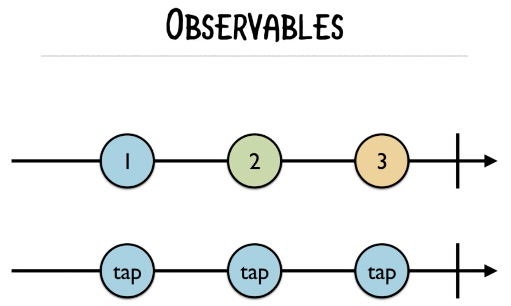
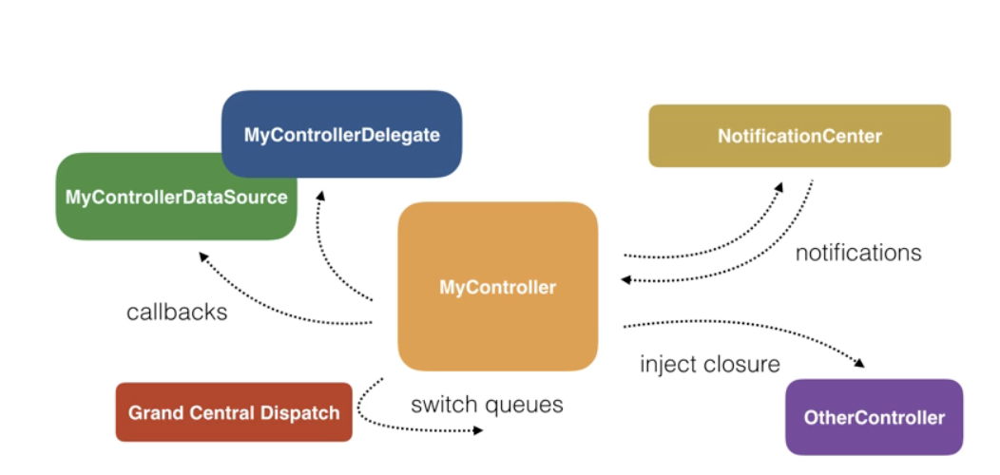
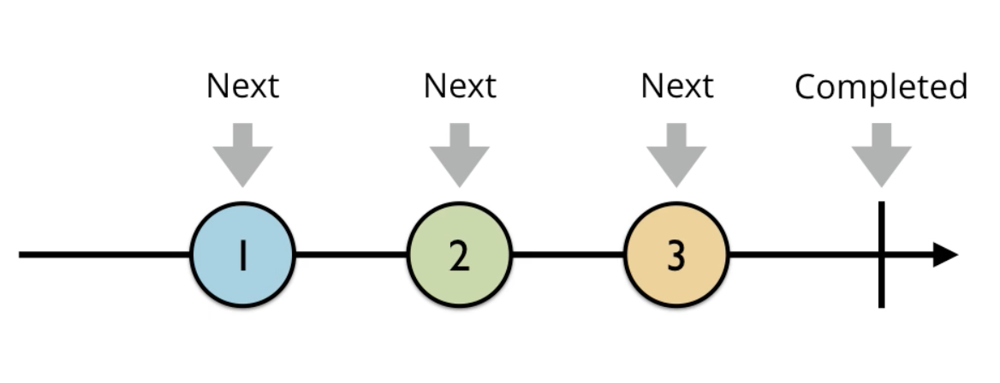

= Hello RxSwift

=== RxSwift

===== ReactiveX
* Rx.NET, RxJS, RxJava, RxRuby, RxKotlin, RxSwift 등등 20개 이상 존재함
* 2009년 Rx.NET으로 ReactiveX가 시작함
* RxSwift는 2015년부터 시작됨

===== RxSwift
* Observables가 기본이 되는 Asynchronour Programming Library
* `ReactiveX 링크 참고` 가 정한 패러다임을 따름
* Observables

===== iOS 비동기 처리가 필요한 상황
* Button Taps
* Keyboard Animations
* Downloading Data
* Processing Images
* Writing on Disk
* Playing Audio, Video
* 일반적으로 iOS SDK API를 이용하여 처리함
* iOS SDK APIs
** Notification Center
** KVO(= Key Value Observing), KVC(= Key Value Coding)
** GCD
** Operation Queues
** Closures
** Target-Action
** Delegation

===== 장점
* 선언적
* 함수적, 반응적
* 일관성 있는 패턴과 연산자
* Mutable State를 다룰 수 있음
* 여러 플랫폼

===== 단점
* 러닝커브가 높음
* 다른 라이브러리들과 의존성
* 이해하지 않고 쓰면 문제가 발생할 수 있음
* 만병통치약이 아님

===== 기본이 되는 패턴
* Observer
* Iterator

=== Observable

===== Observable<T>
* 요소가 가지고 있는 이벤트를 계속 방출함
* Subcribers가 방출한 이벤트들에 대해 반응할 수 있음

===== Observable의 Life Cycle 
* Next 
** Interger 또는 Tap
* Error 
** Observable 종료됨
* Completed 
** Observable 종료됨

===== Observable Events
* 열거형으로 구성됨

[source, swift]
----
public enum Event<Element> {
    case next(Element)
    case error(Swift.Error)
    case completed
}
----

=== RxSwift 설치

===== RxSwift가 Import가 제대로 되지 않는다면
* Project Clean 
* Project Clean으로 안된다면 ?
** Command + , > Locations > Deviced Data의 경로를 확인하고 해당 경로로 들어가 캐시된 프로젝트 파일을 지우고 해당 프로젝트 다시 염

=== 참고
* http://reactivex.io[ReactiveX]
* https://videos.raywenderlich.com/courses/116-beginning-rxswift/lessons/1[Beginning RxSwift]
* https://store.raywenderlich.com/products/rxswift[RxSwift eBook]
