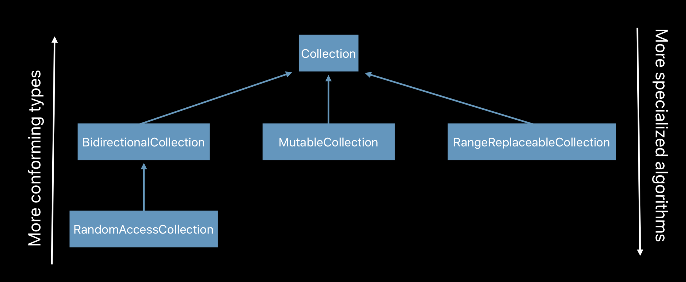
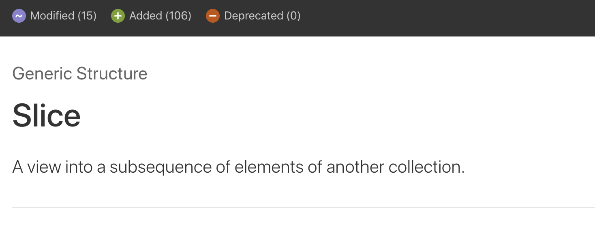
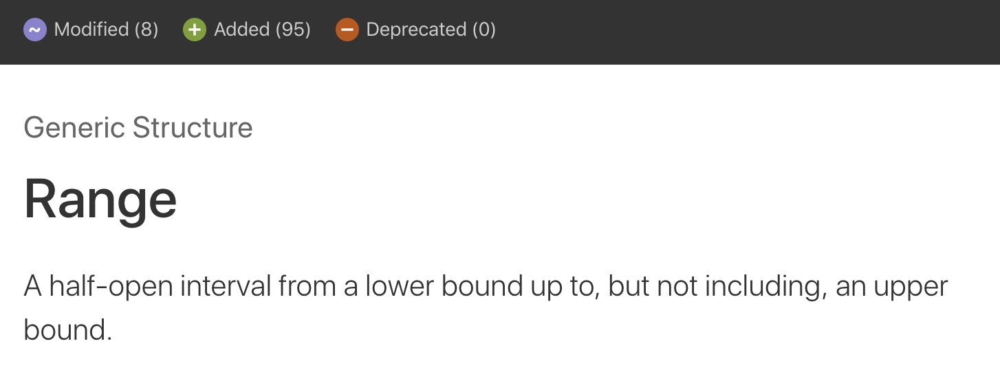

= Swift 4.2에서 Generics

===== Parametric Polymorphism
* 매개변수 다형성

[source, swift]
----
// Any => Element로 대체함
struct Buffer<Element> {
    let count: Int

    subscript(at: Int) -> Element {
        // fetch from storage
    }
}
----

* 공통으로 추출함

[source, swift]
----
// extension Buffer where Element == Int {

extension Buffer where Element: Numeric {
    func sum() -> Element {
        var total: Element = 0
        for i in 0..<self.count {
            total += self[i]
        } 
        
        return total
    }
}

let total = numbers.sum()
----

===== Designing a protocol
* protocol Collection 

[source, swift]
----
protocol Collection {
    associatedtype Element
    associatedtype Index: Equatable
    subscript(at: Index) -> Element 
    
    func index(after: Index ) -> Index 
    
    var startIndex: Index { get }
    var endIndex: Index { get } 
}

extension Collection {
    func map<T>(_ transform: (Element)->T) -> [T] {
        var result: [T] = [] 
        
        // 결과로 리턴할 Array 길이를 미리 정하면 성능 최적화를 얻을 수 있음
        // Collection의 count
        result.reserveCapacity(self.count)

        var position = startIndex
        while position != endIndex {
            result.append(transform(self[position]))
            position = index(after: position)
        }
        
        return result
    } 
}
----

===== Protocol Inheritance
* BidirectionalCollection
** Collection Protocol을 상속받으며 차이점은 역방향 탐색이 가능함
** Fisher-Yates Shuffle
* RandomAccessCollection
** 순서대로 하나씩 요소에 접근하는 대신, 해당 요소로 바로 접근할 수 있음
* MutableCollection
** 요소들의 값을 설정할 수 있는 기능을 제공함
* RangeReplaceableCollection
** Collection 중간의 요소를 다른 것으로 교체할 수 있는 기능을 제공함
* 무작정 도입하기보다 세부적이고 특수한 기능이 필요할 때 프로토콜 상속을 구현하는 것이 좋음

===== Conditional Conformance
* `Conditional Conformance in the Standard Library, Swift 4.2 변경사항 링크 참고`
** Swift 4.1에서 Dynamic Queries가 제대로 지원하지 않았지만, 4.2에서 고쳐짐

[source, swift]
----
// Slice
// * Generic Adaptor Type
// * 모든 Collection에서 사용할 수 있음

// Forming a slice
struct Slice<Base: Collection>: Collection { ... }
let slice = buffer[i..<j]

// Forward search
buffer.index(where: { $0.isEven })
slice.index(where: { $0.isEven })

// Backward search
buffer.lastIndex(where: { $0.isEven })

// No member named lastIndex(where:) on type ‘Slice<Buffer<Element>>’: 순방향은 문제가 없으나 역방향에서 컴파일 에러 발생함
// => BidirectionalCollection 확장해서 컴파일러 에러를 없앨 수 있음
slice.lastIndex(where: { $0.isEven })

extension Slice: BidirectionalCollection where Base: BidirectionalCollection { 
    func index(before idx: Index) -> Index { return base.index(before: idx) }
}

extension Slice: RandomAccessCollection where Base: RandomAccessCollection {
    func index(_ idx: Index, offsetBy n: Int) -> Index { return base.index(idx, offsetBy: n) } 
    func distance(from s: Index, to e: Index) -> Int { return base.distance(from: s, to: e) }
}

// Ranges
let doubleRange = 2.71828 ..< 3.14159

/* 
struct Range<Bound: Comparable> {
    let lowerBound: Bound
    let upperBound: Bound
    func contains(_ value: Bound) -> Bool { ... }
}
*/

doubleRange.contains(3.0)

let intRange = 17 ..< 42

/* 
struct CountableRange<Bound: Strideable> where Bound.Stride: SignedInteger {
    let lowerBound: Bound
    let upperBound: Bound
    func contains(_ value: Bound) -> Bool { ... } 
}

extension CountableRange: RandomAccessCollection { ... }
*/ 

intRange.contains(25)

extension CountableRange: Collection, BidirectionalCollection, RandomAccessCollection {
    // ...
}

typealias CountableRange<Bound: Strideable> = Range<Bound> where Bound.Stride: SignedInteger
----

===== Tips
* Write an extension, have it conform to one protocol, so you know what that extension is for, you know its meaning

===== 참고
* https://developer.apple.com/videos/play/wwdc2018/406/[WWDC2018 - Swift Generics]
* https://developer.apple.com/videos/play/wwdc2018/223/[WWDC2018 - Embracing Algorithms]
* https://developer.apple.com/videos/play/wwdc2018/229/[WWDC2018 - Using Collections Effectively]
* https://developer.apple.com/documentation/swift/slice?changes=latest_major[Slice]
* https://developer.apple.com/documentation/swift/range?changes=latest_minor[Range]
* https://swift.org/blog/conditional-conformance/[Conditional Conformance in the Standard Library]
* http://zeddios.tistory.com/547[Swift 4.2 변경사항]
