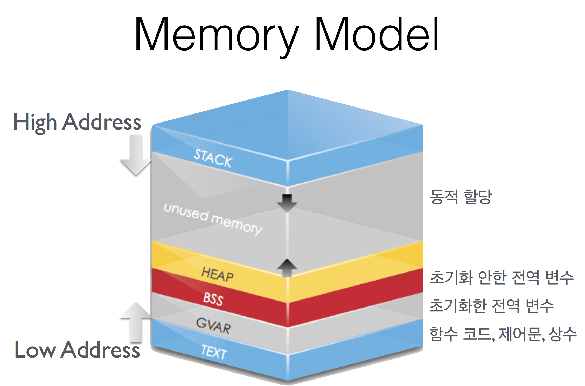
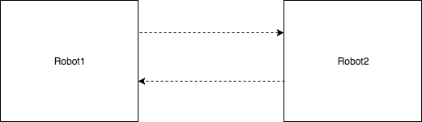
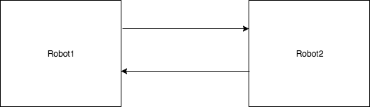
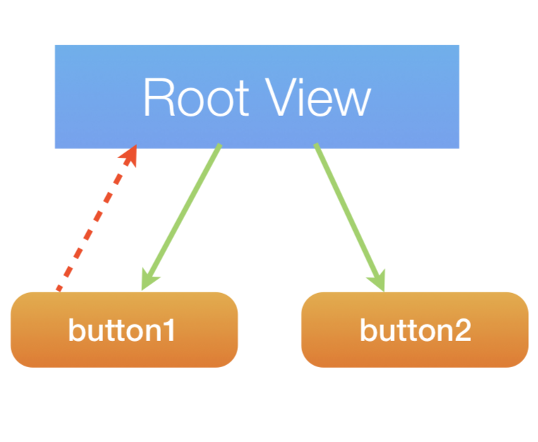
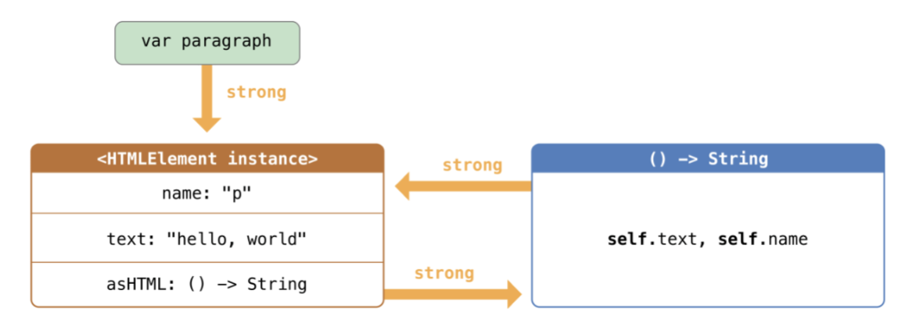

= Memory

=== 변수, 포인터

===== 변수 
* 값을 직접 저장하는 메모리 공간
* 변수에 접근하면 그 값에 직접 접근하는 것

===== 포인터 변수
* 다른 변수에 접근하는 것

=== 연속 배열(Continuous Array), 링크드 리스트(Linked List)

===== 연속 배열 
* 배열은 같은 타입이 연속해서 배치된 것
* 배열 요소에 접근하려면 포인트 변수 활용
* 중간에 추가, 삭제, 변경이 어려움

===== 링크드 리스트
* 링크드 리스트는 포인터로 다음 변수를 연결한 확장 구조
* 다음 변수만 바꾸면 추가, 삭제, 변경이 쉬움

=== Value, Reference

===== Value Types(on Stack)

[source, swift]
----
let origin = CGPoint(x: 0, y: 0)

// 값 복사가 일어남 => Call By Value
var other = origin

other.x += 10

// origin => (0, 0)
// other => (10, 0)
// Value semantics
----

===== Reference Types(on Heap)

[source, swift]
----
var myMilk = ChocoMilk()
myMilk.amount 300

// 값이 복사되는 형태가 아니라 새로운 참조가 생김 => Call By Reference
var yourMilk = myMilk
yourMilk.amount = 300

// myMilk, yourMilk => amount => 100
print(myMilk.amount)
----

===== Value Types Reference
* `inout` => Call By Reference
** Objective-C의 호환 때문에 주로 쓰이지만 권장하지 않는 방법
* Value Type를 여러 번 복사할 때 경우에 따라서 공통적인 클래스를 하나 만들어서 참조하는 것이 나을 때가 있음

=== OS Process Memory Model

===== Text
* 함수코드

===== BSS, GVAR
* 클래스 선언 영역 이외 부분 및 Static 변수. 전역 변수
* 전역 변수들을 모아서 컴파일하고 어딘가에 저장함. Stack이나 Heap 이외 영역에서 쌓임

===== Stack 
* Value Type 인스턴스
* 값이 들어감
* 함수 호출
* 내부변수(상수)
* 돌아갈 곳을 저장함
** print() 함수코드가 Text에 있음. 함수코드가 호출되면 Stack에 매개변수와 리턴타입이 차례대로 쌓이다가 호출된 후 차례대로 지워짐

===== Heap 
* Class 인스턴스
* 메모리 주소가 저장함
* 참조할 때 해당 메모리 주소에 화살표가 생긴다고 생각하면 됨
* Stack이 위에서 아래로 쌓이고 Heap이 아래에서 위로 쌓임. 더 쌓일 수 없을 때 오버플로가 발생함

===== 추가 정리
* NSPen 메모리 주소는 Heap에 저장되어 있으며 myPen의 변수는 Stack에 NSPen의 메모리 주소 값을 저장함
* yourPen을 만들면 myPen과 같은 메모리 주소 값을 가지고 있지만 같은 객체는 아님
* whichPen과 myPen은 같은 클래스
* Reference Types을 사용하면 Identity, Equtlity 구현해야 할지 고민이 됨

[source, swift]
----
var myPen = NSPen()
var yourPen = NSPen()
var whichPen = myPen
----

=== Identity vs Equality

===== Identity
* 메모리 영역이 같은 경우 Identity가 같다고 함

===== Equality
* 메모리 영역은 다르지만 값이 같은 경우 Equality가 같다고 함
* `Identity, Equality 링크 참고`

===== 객체(인스턴스)를 비교한다는 것
* 같은 클래스인가 ?
* Identity가 같은가 ?
** `===` 비교 연산자 이용
* Equality 객체인가 ?
** `==` 비교 연산자 또는 `Equatable 프로토콜`
** 값을 비교하거나 Hash를 구현함

=== iOS Memory

===== iOS Memory
* 시스템 메모리가 30-40%를 사용하고 있음
* 가상메모리는 500MB 이하 사용하는 것이 좋음
* Warning 
** 메모리 해제
** 메모리 해제해도 메모리가 부족하면 백그라운드 앱 종료
** Background 앱 종료해도 메모리가 부족하면 Foreground 앱도 죽임
* Runtime에서 레퍼런스 카운트가 0이 되면 객체가 소멸함
** 객체 생성(init)과 소멸(deinit) 사이에서 생성 시점, 소멸 시점이 중요함

===== Instruments
* 어느 시점에서 계속 증가만 한다면 Instruments로 확인하는 것이 좋음
* 최신 폰보다 구형 폰에서 버그 재현하기가 좋음

===== Referece Counting
* Stack에서 생기는 값은 메모리 관리가 괜찮지만
* Heap에서 생기는 것에 대해서 메모리 관리하기 위해 Referece Counting 이라는 개념으로 메모리 관리를 함
* 생성 1, 소유권 획득하면 1 증가, 스코프에서 벗어나면 1 감소. Referece Counting 0이 되면 객체가 소멸함

===== Manual Reference Count
* 개발자가 직접 관리함
* Objective-C에서 명시적으로 생성하고 없애줘야 함

===== Auto Reference Count
* 자동 메모리 관리함

===== strong 변수
* 모든 객체 포인터 변수는 `strong` 변수(기본값)
** _소유권을 가지고 있는 객체가 누구냐? => 어떤 객체가 생성한 것인가?라는 의미와 같음_
** 자동으로 retain 처리됨
** 자동으로 레퍼런스 카운트가 1인 상태로 작동한다고 생각하면 됨
** 이전 객체는 대입할 때 해제됨
** strong 변수는 초깃값을 0으로 설정됨

===== 강한 참조
* Class Robot 생성하는 시점과 소멸 시점을 명확하게 관리할 수 있음
* 소멸은 레퍼런스 카운트가 0일 때만 작동함

[source, swift]
----
class Robot : NSObject {
    var name : String
    var nemesis : Robot?
    var model : Int
    override init() {
        name = ""
    nemesis = nil
    model = 0 
    }

    deinit {
        print("robot was deinit")
    } 
}

// Heap에 Robot 메모리 주소 하나가 생성되어 있음. Stack에서 메모리 주소 값이 3개 있음
var robot1 : Robot?
robot1 = Robot()
var robot2 : Robot?
var robot3 : Robot?
robot2 = robot1
robot3 = robot1

// Reference Counting는 Heap 관리하는 주체에서 Count만 제거함
// Heap의 Robot 메모리 주소가 사라지는 것은 아님. 객체가 있는 상태에서 메세지 보내는 것은 문제가 되지 않지만, 객체가 소멸된 뒤, 메세지는 보내는 것이 문제가 됨
// Class 안에 Value Type이 들어가면 Heap에서 값을 관리하는 영역이 생김
// App Extension Programming Guide: https://developer.apple.com/library/content/documentation/General/Conceptual/ExtensibilityPG/ExtensionScenarios.html
robot2 = nil
robot3 = nil

// Array 만듦 => Array 안에 객체 때문에 레퍼런스 카운트가 증가함 => Array에서 removeAll로 요소를 제거해주는 동작 해야 레퍼런스 카운트가 줄어듦
var workArray = [robot1] 
robot1 = nil

// Release가 됨
workArray.removeAll()
----

===== 강한 참조 순환문제

[source, swift]
----
var robot1 : Robot? = Robot()
var robot2 : Robot? = Robot()

robot1?.nemesis = robot2
robot2?.nemesis = robot1

// 객체 참조에서 순환 참조(상호 참조한 상태)에서 변수만 nil을 할당한다고 순환 상태는 지워지지 않기 때문에 레퍼런스 카운트가 1인 상태
// nemeis 접근할 수 있는 방법은 없음
// 이런 상태를 Garbage(비슷한 단어로 아일랜드 구조)라고 함
// 그래서 Garbage Collector가 작동하는 언어에서 이러한 상태가 관리가 되지만 Swift는 이러한 상태가 관리가 되지 않기 때문에 문제가 발생함
robot1 = nil
robot2 = nil
----
    

===== 약한 참조
* 순환 참조 문제 때문에 `weak` 생김
* 소유한 관계가 아닌 다른 객체가 생성한 것은 weak를 사용하는 것이 좋음
** 하위 모듈이 상위 모듈을 호출하는 것이 좋은 구조가 아님
** 상위 모듈을 생성하는 것이 하위 모듈이 아니기 때문임(= 하위 모듈이 상위 모듈에 대한 소유권을 가지고 있지 않음)

[source, swift]
----
class Robot : NSObject {
    var name : String
    // 약한 참조
    weak var nemesis : Robot?
    var model : Int

    override init() {
        name = ""
        nemesis = nil
        model = 0 
    }
    
    deinit {
        print("robot-\(name) was deinit")
    } 
}

var robot1 : Robot? = Robot()
var robot2 : Robot? = Robot()
robot1?.name = "thomas"
robot1?.nemesis = robot2
robot2?.name = "9j"
robot2?.nemesis = robot1
robot1 = nil
robot2 = nil

// robot-thomas was deinit
// robot-9j was deinit
----

===== weak 키워드
* 레퍼런스 카운트에 영향을 주지 않음
* 서로 바라보고 있다가 하나의 객체가 사라지면 weak 변수에 nil 처리를 자동으로 해줌
* View 소유관계
** 첫 번째, 이미지는 Root View와 Child View가 소유하는 관계
** 두 번째, 이미지는 Table View와 Cell의 관계

===== unowned 미소유 참조
* `unowned` 을 사용하면 참조 카운트를 반영하지 않음. weak 키워드와 다르게 nil처리도 해주지 않음
* 하위 호환성을 위해 사용함
* 객체가 사라져도 nil로 바뀌지 않고 항상 값이 있다고 가정함
* Class, Class-Protocol 관계에서만 사용 가능함

[source, swift]
----
class Customer {
    let name: String
    var card: CreditCard?
    init(name: String) {
        self.name = name
    }

    deinit { 
        print("\(name) is being deinitialized") 
    }
}

// 명확한 소유참조 관계일 때 예를 들어 고객과 신용카드 관계 => 상속 관계가 아닌 포함 관계
// 고객이 탈퇴하면 신용카드 객체가 사라져야 함
// unowned 쓰지 않으면 고객이 사라져도 신용카드 객체가 사라지지 않음

class CreditCard {
    let number: UInt64
    unowned let customer: Customer
    init(number: UInt64, customer: Customer) {
        self.number = number
        self.customer = customer
    }
    deinit { print("Card #\(number) is being deinitialized") }
}
var john : Customer? = Customer(name: "John Appleseed")
john!.card = CreditCard(number: 1234_5678_9012_3456, customer: john!)
john = nil
----

===== 클로저 강한 참조 순환
* 클로저도 하나의 객체로 생각해야 함
* 객체 안의 클로저가 self 값 캡처로 사용될 때 weak 또는 unowned 키워드를 사용함

[source, swift]
----
class HTMLElement {
    let name: String
    let text: String?

    // 클로저가 호출되면 레퍼런스 카운트가 0이 되어야 하는데 self로 인해 레퍼런스 카운트가 해제되지 않는 경우도 발생함
    lazy var asHTML: () -> String = {
        if let text = self.text {
            return "<\(self.name)>\(text)</\(self.name)>"
        } else {
            return "<\(self.name) />"
        }
    }

    init(name: String, text: String? = nil) {
        self.name = name
        self.text = text
    }

    deinit {
        print("\(name) is being deinitialized")
    }
}   

var paragraph: HTMLElement? = HTMLElement(name: "p", text: "hello, world")
print(paragraph!.asHTML())
// "
hello world
"

lazy var someClosure: (Int, String) -> String = {
    [unowned self, weak delegate = self.delegate!]
        (index: Int, stringToProcess: String) -> String in

    // ... 
}

// weak와 unowned 둘 다 사용해도 무방하지만, unowned보다 weak가 나을 수 있음
// 캡쳐할 때 실행될 때 레퍼런스가 복사됨. strong 관계로 무조건 만들어짐. 호출하고 나서 closure 내의 참고하고 있는 self 관계를 날리기 위해 weak하게 만듦
lazy var someClosure: () -> String = {
    [unowned self, weak delegate = self.delegate!] in
    
    // ... 
}
----

===== @autoreleasepool 블록
* 소유권을 보장해주기 위해서 사용함
* Objective-C => retain, release. A의 객체가 C의 객체를 생성해서 A가 C의 Ownership을 가지고 있지만 B로 Ownership을 옮기고 싶을 때 사용함. B가 retain을 하면 B가 Ownership을 가짐. 만약 retain 하지 않으면 @autoreleasepool이 Ownership을 release 시킴
* Swift
** 레퍼런스 카운트를 이해하기 쉬운 개념은 "소유권" 이라는 개념을 생각하면 됨
** 강한 참조
*** 소유권을 가지고 있음
*** return
** weak, unowned
*** nil
** 강한 참조를 하는 객체가 소멸하기 전 소유권을 임시 pool에게 이전하여 사용함
** lazy 처리, for 문에서 계속 객체를 만들거나 함수 처리가 끝나기 전에 다른 처리가 있을 때 사용함

[source, swift]
----
autoreleasepool { () -> () in
    // ...
}
----

=== Pointers

===== 정의
* 특정한 메모리 위치를 참조하는 것을 포인터라고 함
* `var pointer: UnsafePointer<Type>`
* 메모리 주소 값이 변수에 들어감

===== Mutable Pointers
* 값이 변경 가능한 포인터

===== Constant Pointers
* 읽기만 가능한 포인터

===== Buffer Pointers
* Array 
** Linked List 
** 변경 작업이 편함
* Buffer 
** Continuous Array 
** 읽고 쓰는 단순 작업하기 좋음 
* 화면 픽셀정보, 미디어 버퍼링 정보

===== Null Pointers

===== C 포인터 맛보기
* 참조변수
* 메모리 주소
* 0x00000000 - FFFFFFFF(32비트) -> 4기가

[source, c]
----
a = {name: "honux", money: 1000}
b = a

a.name

// a.money + a.name 메모리 크기
a.moeny 
----

* &a
** a의 주소값
** 비트 연산자
* *b
** b는 포인터 변수
** b = &a
** print(b) => pointer
** print(*b) => pointee 
*** b가 참조하고 있는 주소를 출력함. 즉 a의 주소를 출력함

=== 참고
* https://developer.apple.com/library/ios/documentation/Swift/Conceptual/Swift_Programming_Language/[Swift Language Guide]
* http://www.kyobobook.co.kr/product/detailViewKor.laf?ejkGb=KOR&mallGb=KOR&barcode=9791162240052&orderClick=LAH&Kc=[스위프트 프로그래밍:Swift4]
* http://rhammer.tistory.com/101[Identity, Equality]