= Swift 프로젝트 개발환경

=== XCode

===== 정의
* 코드 편집기
* 컴파일러
* 디버거
* XCode와 관련된 것은 특히 디버깅은 항상 시간이 날때마다 의식적으로 연습해야 함

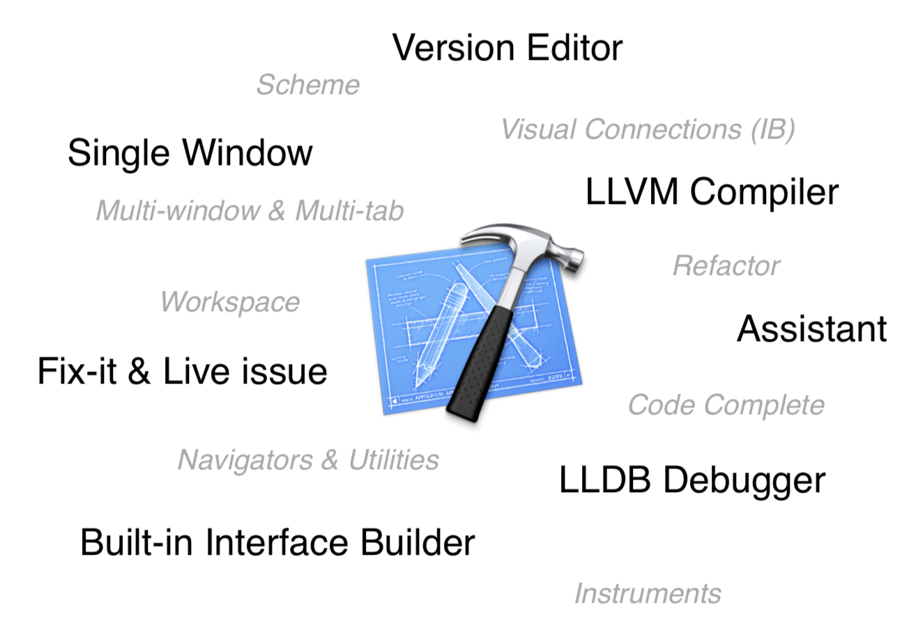

===== 영역
. 네비게이터 영역
** 프로젝트 네비게이터
** 심볼 네비게이터
** 검색 네비게이터
** 이슈 네비게이터
** 이슈 네비게이터
** 테스트 네비게이터
** 디버그 네비게이터
** 브레이크포인트 네비게이터
** 로그 네비게이터
. 인스펙터
** 파일 인스펙터
** 빠른 도움말
** 아이텐티티 인스펙터
** 속성 인스펙터
** 크기 인스펙터
** 연결 인스펙터
** 바인딩 인스펙터
** 뷰 이펙트 인스펙터
. 라이브러리
** 파일 템플릿
** 코드조각
** 인터페이스 객체
** 미디어

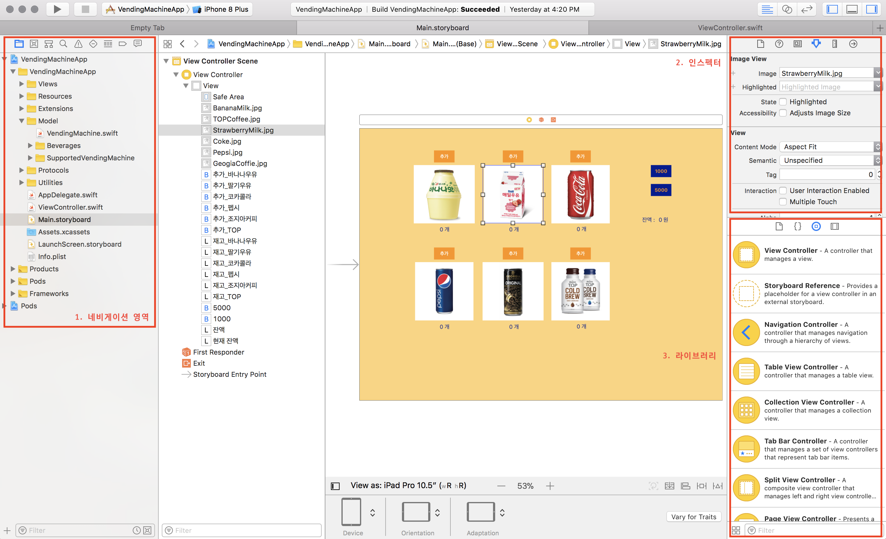

=== XCode Concept

===== Target
* 프로젝트의 Product를 빌드하기 위한 절차를 포함. 관리상 최소 단위
* Build Settings, Build Phases, Dependencies
* 프로젝트 안에 여러 개 Target을 만들 수 있음
* Project 소스를 어떻게 구성하느냐에 따라서 여러 Target이나 빌드 파일을 만들 수 있음
* 의존성이 생길 수 있음

===== Project
* SW Products를 위한 모든 파일, 리소스, 정보 포함(= 모든 소스 파일)
* Sources, Groups, Project-level Build Config, Targets, Excutable Environments

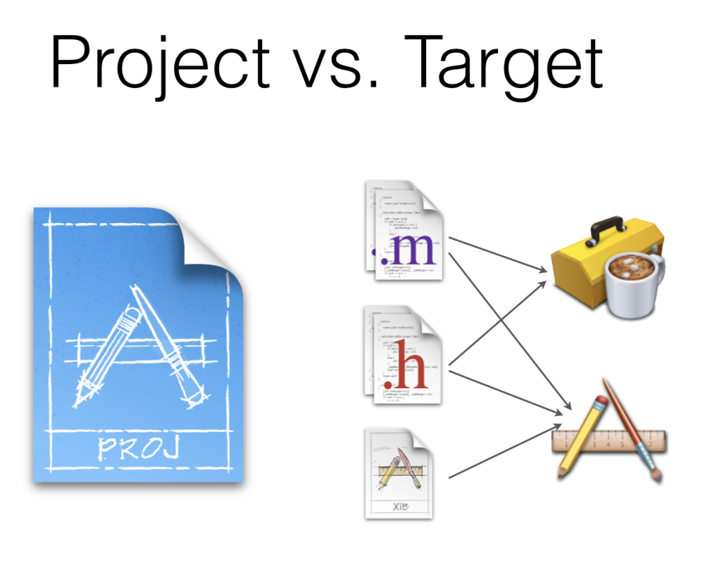

===== Workspace
* Projects 그룹, 관련된 문서들
* 폴더를 하나 만들면 숨겨져 있지만 Workspace가 하나 생성함
* Content-Aware Features in Workspace
✱* Code-Completion, Jump to Definition, Refactoring ... 
✱ Share the build directory

===== Scheme
* 빌드, 빌드 설정, 실행과 테스트를 포함하는 플랜
* 롤을 어떻게 묶을 것인가?
** 기획자, 개발자, QA 등 테스트, 실행 범위가 역할에 따라 다름
*** App, Library, Unit Tests => x축
*** 시뮬레이터, 디바이스 => y축
*** Debug, Release => z축
    *** Build and Debug => 시뮬레이터, 디바이스
    *** Unit Tests => 시뮬레이터

===== Project vs Workspace
* 설정에 따라
* 하나의 Workspace 안에 Project들이 의존적(= Dependency)
* 여러 개 프로젝트가 있을 수 있음

===== 워크스페이스 안에 프로젝트 A, B가 있고 정해놓은 Scheme에 따라 Target 범위가 설정됨
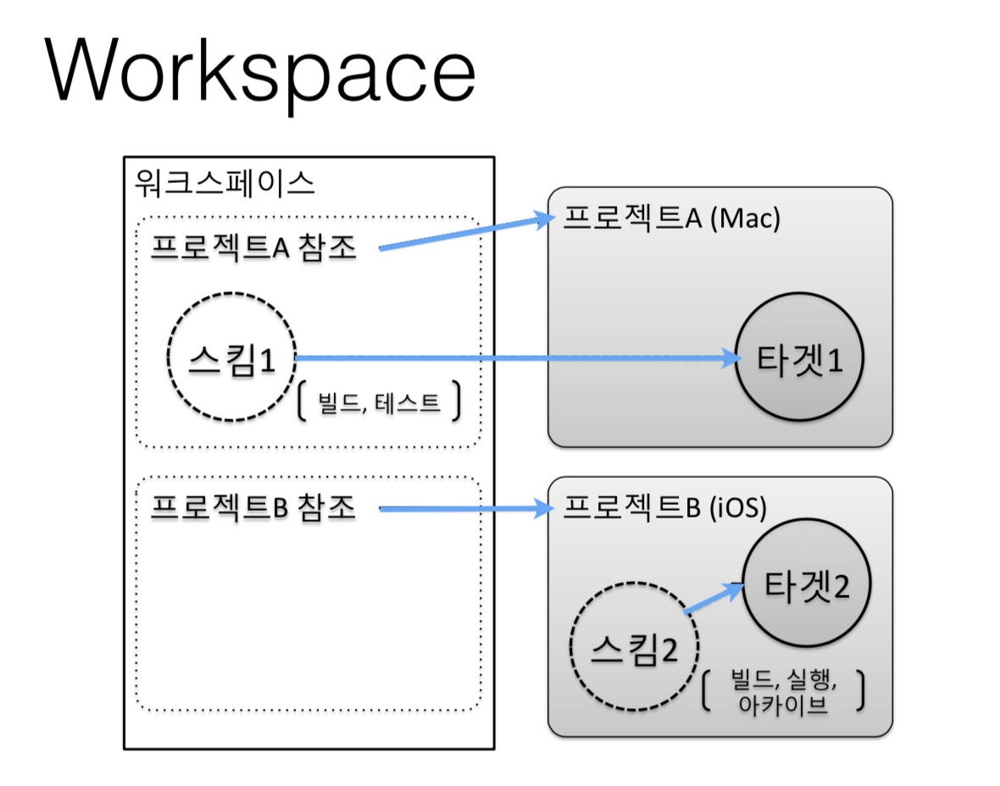

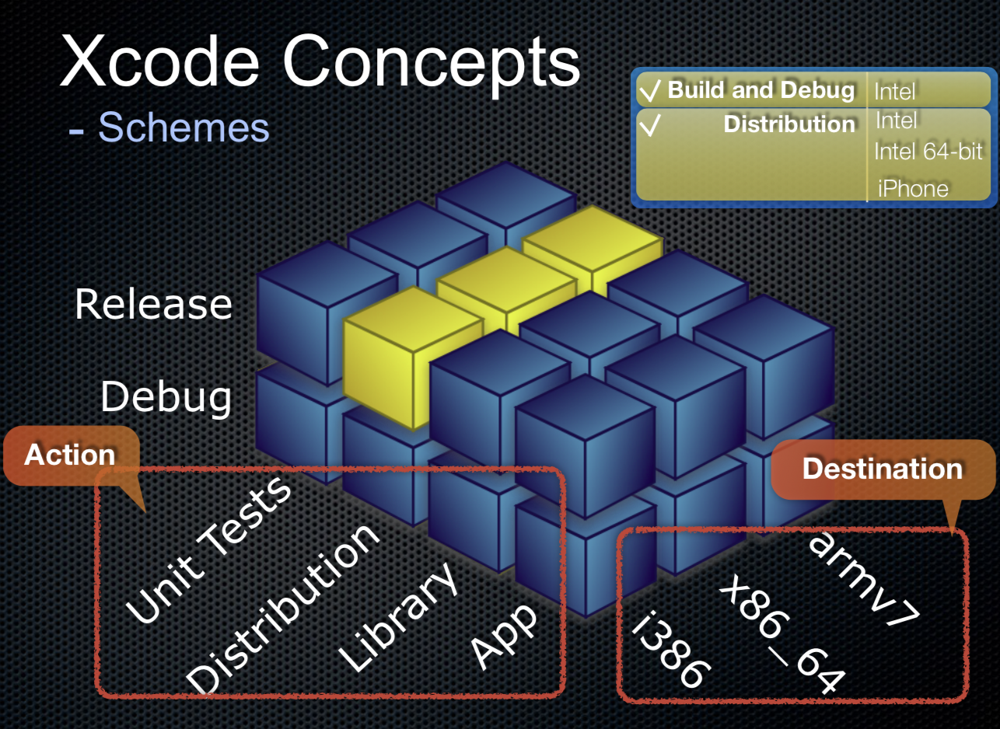

=== Debugging Tip => Breakpoint Action, Behaviors 

===== Breakpoint Action
* Action(동작)
** AppleScript, Capture OpenGL ES Frame, Debugger Command, Log Message, Shell Command, Sound
* Options(선택사항)
* *Log Message. print 찍을 필요 없음. 디버깅 도구를 활용하자. print 함수를 소스에서 넣지 말자!*

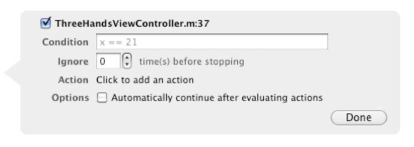

===== Exception Breakpoint
* 프로젝트 전체 범위
* 예외(Exception) 발생할 경우 
* C++, Objective-C 형태
* *예외처리 동작 설정 가능*

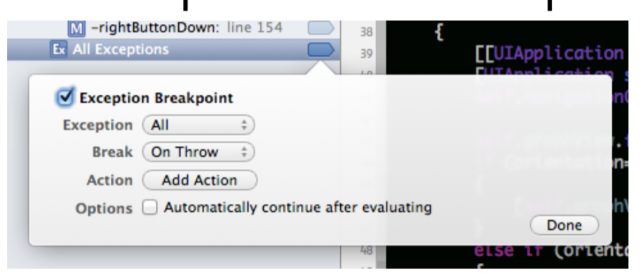

===== Symbolic Breakpoint
* 소스 코드의 심벌 이름에 설정 
* [클래스 +] 메서드 형태 심벌 
* 지정 모듈(라이브러리) 지정
* Apple이나 다른 모듈에서 만든 소스를 확인할 수 없어서 디버깅을 걸지 못할 때 동작이 원하는 부분에 멈추게 하기 위해서 쓰는 부분임
 
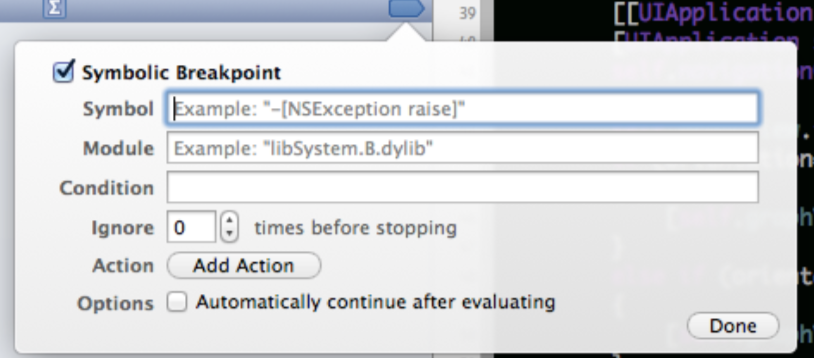

===== Behaviors
* 빌드, 테스트 등 동작 뒤에 커스텀 명령어를 만들 수 있고 다른 동작을 실행시킬 수 있도록 설정할 수 있음

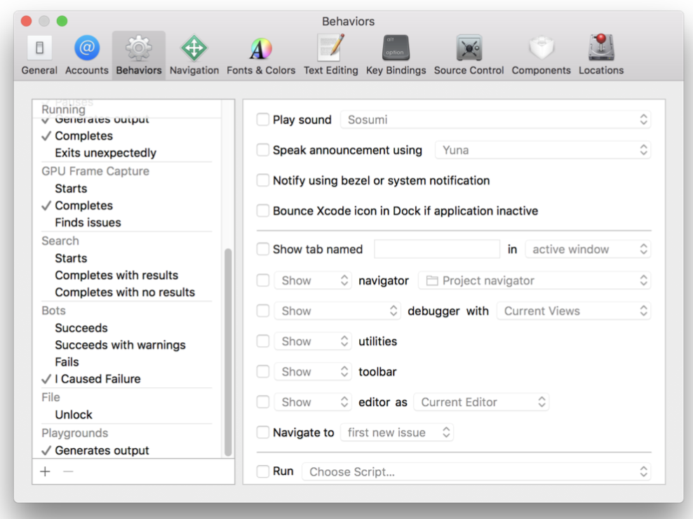

=== Debugging Tip => Static Analysis

===== ASAN(= AddressSanitizer)
* Swift 컴파일러가 정적 분석을 함. Objective-C는 정적 분석이 힘듬
* Objective-C 포인트 관리가 잘못되었을 때 어떤 객체가 잘못한 것인지 알려줌
* Swift에서 C와 연결할 때 사용함
** 죽은 코드
** 메모리 누수
** 널 참조
** 논리적 오류

=== Debugging Tip => Diagnostics

===== Edit Scheme ... -> Run -> Diagnostics
* 단축키 => `Command + Shift + ,`

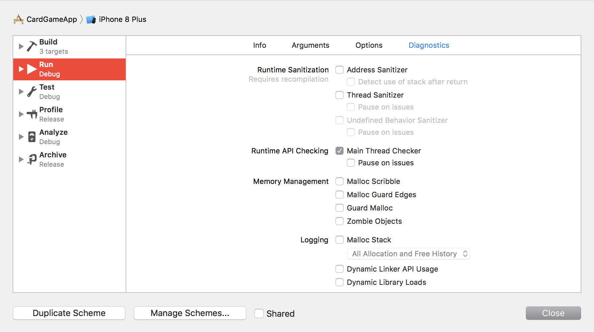

===== Runtime Sanitization
* Address Sanitizer
* Thread Sanitizer

===== Memory Management
* Malloc
** Enable Scribble
** Enable Guard Edges
* Guard Malloc
* Objective-C -> Zombie Objects

===== Logging
* Malloc Stack
* Dyld API Usage
* Library Loads

=== Debugging Tip => Multi-tap, Multi-window

=== Debugging Tip => LLDB
* 개인적으로 `po` 보다 `expr` 를 자주 씀:)
* Mac, XCode에서 전체적으로 쓸 수 있는 디버거 도구

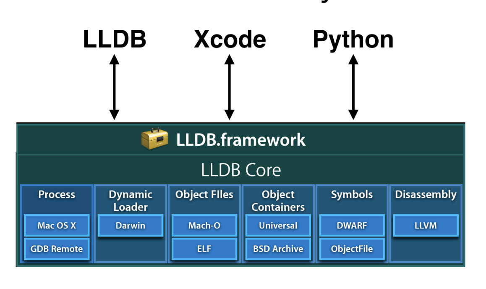

=== Quicklook

=== 메모리 디버깅 그래프
* 사이클이 있는지, 섬이 있는지 메모리 누수 확인이 필요함

=== 참고
* https://www.slideshare.net/JiandSon/xcode-debugtipskey[Xcode를 활용한 디버깅 팁(OSXDEV)]
* https://academy.realm.io/kr/posts/swift-tools-xcode-lldb-instrument/[스위프트 개발 환경의 변화]