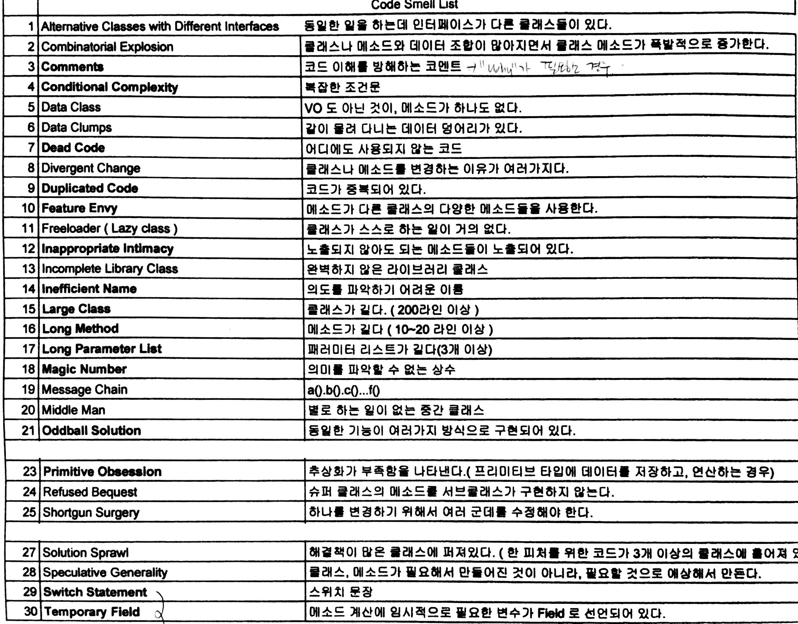
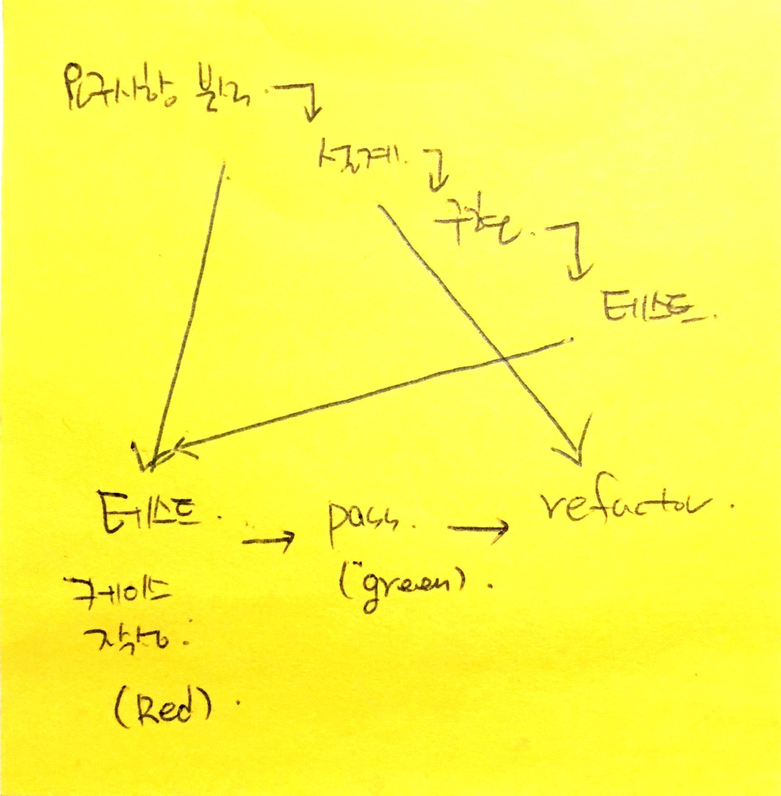
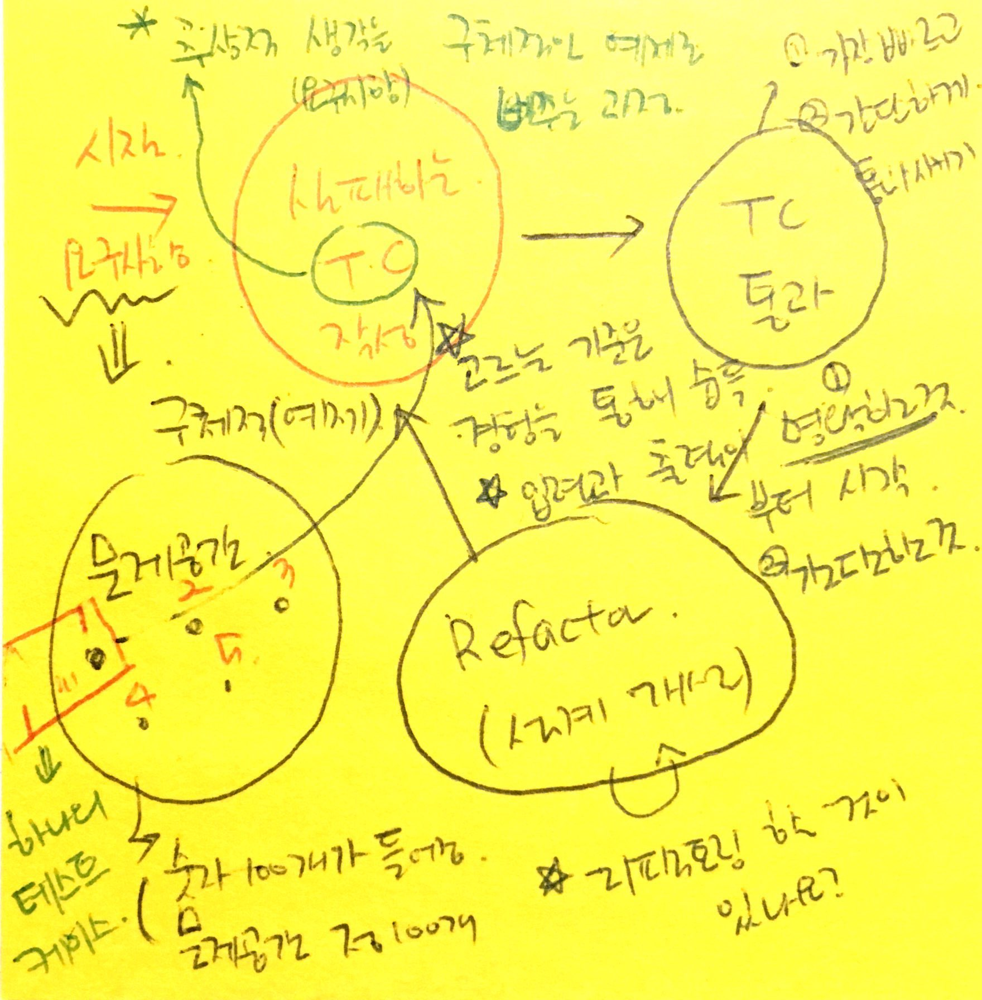
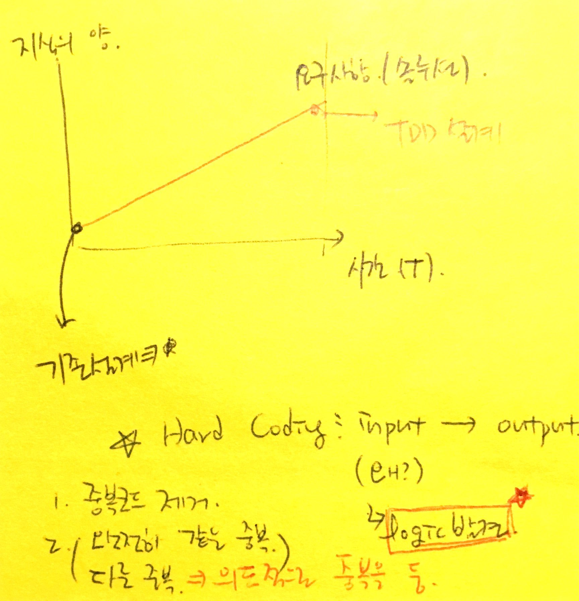
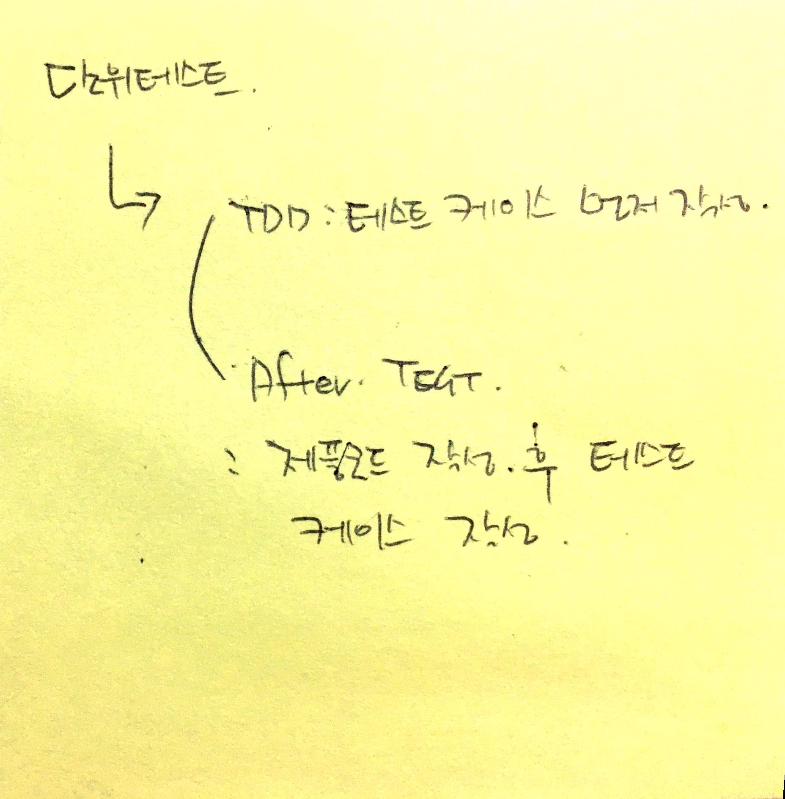
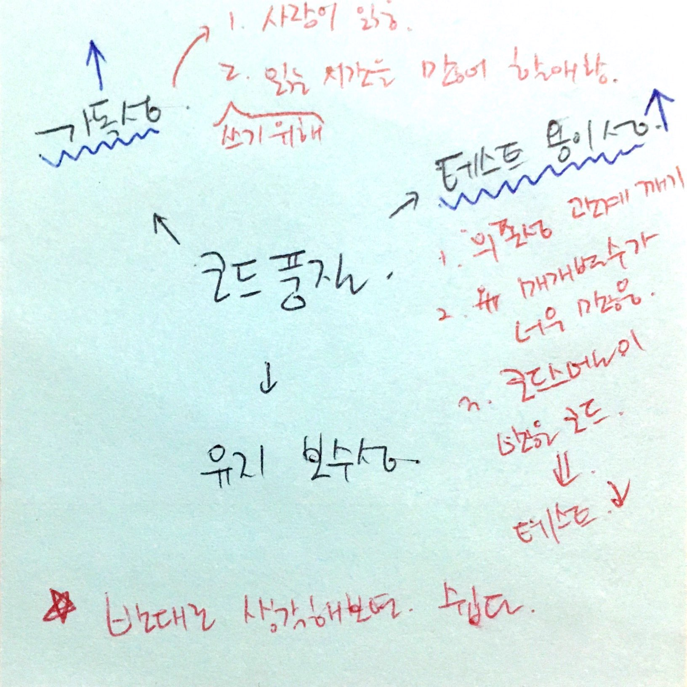
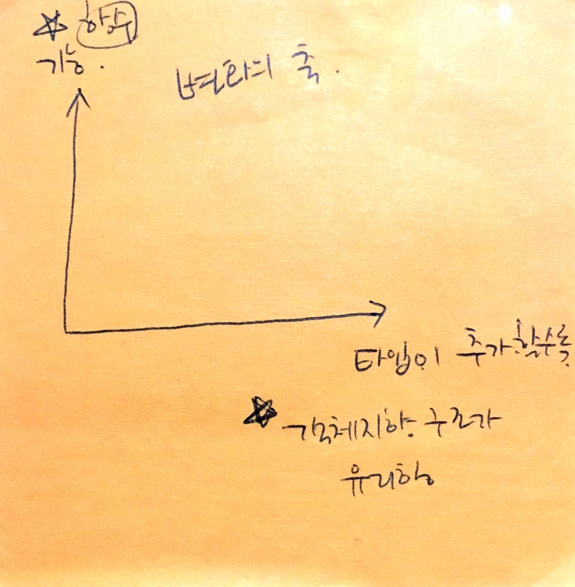

= TDD, Refactoring 스터디 정리

=== 레거시 코드 리팩토링

===== 코드 스멜
* 코드를 관찰하고 이상한 부분을 느낌. 직관을 찾는 훈련. 뭐가 불편하지?
** 관찰 -> 느낌 -> 생각
* 주석
** 코드에는 What, How는 있으나 Why가 없음. Why를 주석으로 남겨야 함
** 처음에 작성한 코드와 주석은 맞았지만, 시간이 지난 후, 코드와 주석 일치하지 않는 경우가 발생함. 그래서 주석도 코드 스멜 목록에 포함됨
* Oddball Solution
** 같은 기능을 여러 패턴으로 구현함. 동일한 기능으로 작동하는 것은 하나의 패턴으로 구현되어 있어야 함
* Primitive Obsession
** 예를 들어 전화번호를 확인할 경우, String으로 처리하는 부분을 클래스 타입으로 정의함

===== Backward Bicycle
* 뇌 회로가 빨리 형성이 되어야 함. 일반적으로 한 달 정도 걸림
* 어른은 시간이 걸리지만, 어린이는 빠름
* TDD도 말은 쉽지만, 습관이 되기 위해 시간이 필요함. 결론은 뇌 회로가 형성되어야 함

===== 리팩토링 전제조건
* 외부 동작을 바꾸지 않으면서 내부 구조를 개선하는 것
* 코드를 변경했을 때, 외부 동작이 바뀌지 않았다는 것을 증명해야 함
* 소프트웨어 요구사항이 들어오면 내가 해야 할 일을 다른 사람에게 넘겼을 때 발생함

===== 레거시 코드 단위 테스트 작성하기
* 생성자 테스트 작성하기
* 테스트 커버리지 측정하기
* 테스트 되지 않은 코드를 커버할 수 있는 새로운 테스트를 작성함(= Characterization Test)
* 테스트 커버리지가 100%에 가까워질 때까지 테스트 코드를 작성함
* Characterization Test
** 코드를 이해하고 짜는 것이 아니라 레거시 코드에 대한 테스트를 작성하면서 레거시 코드를 이해함
* 코드 중복을 없애야 함. 추상화하는 것?
** 메서드 이름이 필요함 => 이름을 짓는 순간 추상화 하는 것
* 테스트 코드에 비지니스 로직만 남겨두는 것이 거의 좋음
* 테스트 코드도 제품 코드에 의존적일 수밖에 없음. 최대한 중복을 피하고 한 곳에서만 수정할 수 있게 테스트 코드도 리팩토링이 필요함

===== High Cohesion, Low Coupling
* High Cohesion
** Customer f1, f2 메서드와 m1, m2 필드가 존재함
** f1 - m1, f2 - m2 사용하고 있다면 서로 다른 것이기 때문에 분리가 필요함
** f1 - m1, f2 - m2, f1 - m2, f2 - m1 사용하고 있다면 응집도가 높아서 그 클래스가 하는 역할이 맞음
** 자기 것을 쓰는 것이 좋음
* Low Coupling
** 복잡도 종류가 많음
** _너도 알고 나도 알면 좋지만 싸이클 의존성이 생기면 좋지 않음_
* *결국 클래스 내 메서드나 변수가 옮겨야 하는 이유가 중요함*

=== TDD

===== 요구사항 분석
* 워터풀 방식
** 요구사항 분석, 이해
*** 시나리오
*** 시뮬레이션
*** Paper Prototyping
** 설계
** 구현
** 테스트
* TDD
** Red
*** 요구사항 분석이 포함되어 있음
*** 테스트 케이스를 작성할 수 없다면 요구사항을 제대로 이해하지 못하고 있는 것
** Green
** Refactor
*** 설계
** 3가지 과정 중에서 Refactor 과정에 설계가 포함됨
** 설계가 뒤로 가는 이유
*** 처음부터 요구사항을 완벽하게 이해하기 힘듦. 그래서 설계 과정에서 수정이 빈번히 일어남
*** 설계는 지식의 양이 가장 많을 때 잘할 수 있음
*** 그런데, 기존 워터풀 방식으로 지식의 양이 가장 적을 때 설계함
* 이 많은 문제 중 무엇을 고를까 ?
** 무작위로 해봄. 경험이 쌓이면 무엇부터 해야할 지 감이 옴
** 잘 아는 것
** 간단한 것
* 테스트 케이스는 얼마나 만들어야 할까?
** 경험을 해봐야 앎

===== 단위 테스트
* Arrange(Given) => 데이터 준비
* Act(When) => 제품 코드를 불러옴
* Assert(Then) => 결과가 맞는지 확인이 필요함
* Arrange가 같다는 것은 결과가 같다는 의미
* 불변 데이터는 생성자, 가변 데이터는 Setter로 구성하는 것이 좋음

===== 단위 테스트와 TDD 차이점

===== 테스트 재정의하기
* 시스템이 요구사항대로 동작하는지를 테스트하는 것은 테스팅인가?
** Specified => 일한 사람(개발자)
** Unspecified => QA, 매뉴얼 테스터
** Checking => 요구사항 대로 구현되었는지 검사하는 과정
** Testing => Unspecified

===== 코드품질
* 가독성
** 사람이 읽음
** 코드를 읽는 시간 vs 코드를 작성하는 시간 => 10 ~ 20 : 1
** 어떻게 하면 가독성이 좋을까? 보다 어떻게 하면 가독성이 떨어질까? 생각하는 것이 좋음
* 테스트 용이성
** 어떻게 하면 테스트를 쉽게 할 수 있을까? 보다 어떻게 하면 테스트하기 어려운 코드일까? 생각하는 것이 좋음
** 의존성을 높임
** 함수의 파라미터를 많이 씀
* 유지 보수성
** 코드 스멜
* 코드 품질을 향상하는 것을 생각할 때 코드 품질을 어떻게 나쁘게 하는 것인지 생각하는 것이 더 쉬움

===== ATDD
* `ATDD 링크 참고`
* TDD, BDD, Step by Egen
* 요구사항 파악(인수조건) -> 인수테스트 케이스 만듦 -> 인수테스트 케이스 개수만큼 자동화함 -> 개발팀은 빨간불이 켜진 것을 초록색으로 만드는 것이 중요함. 하나의 케이스에 대해 TDD로 작성함 -> 자동화로 넘어와서 다른 클래스 작성함
* Outside-inside approch
* Inside-outside approch

===== Tips
* IntelliJ
** Color Scheme > General > Line Coverage > Foreground 같은 색깔로 Background 설정하고 Foreground 선택 해제
* 새로운 기능이 추가되면 함수, 새로운 타입이 추가된다면 계층 구조가 좋음

* http://www.aladin.co.kr/shop/wproduct.aspx?ItemId=671339[패턴을 활용한 리팩터링]
* http://www.aladin.co.kr/shop/wproduct.aspx?ItemId=27490110[테스트 주도 개발로 배우는 객체 지향 설계와 실천]
* http://exercism.io/[Exercism]
* http://www.cyber-dojo.org[Cyber Dojo]
* https://www.codingame.com/home[Coding Game]

=== 참고
* https://www.slideshare.net/jaehoonoh/ss-63436044[ATDD]