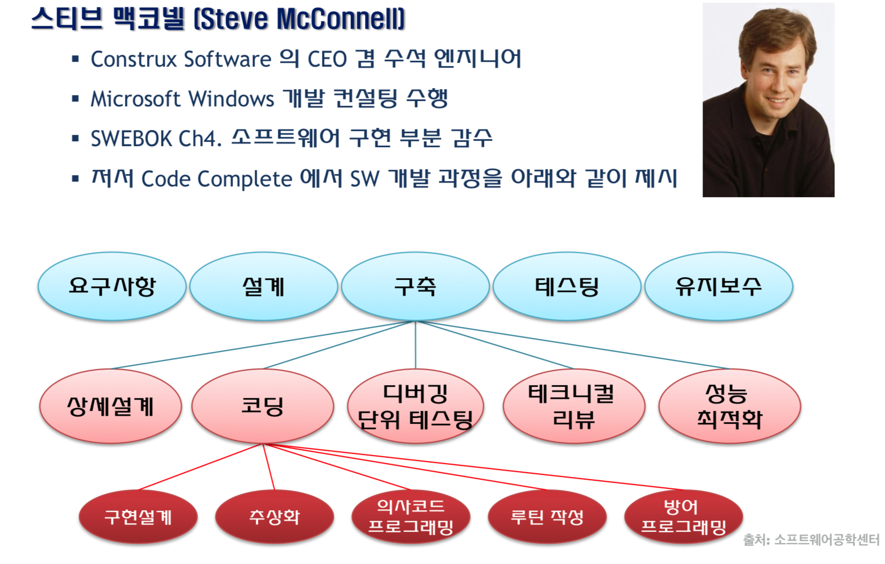
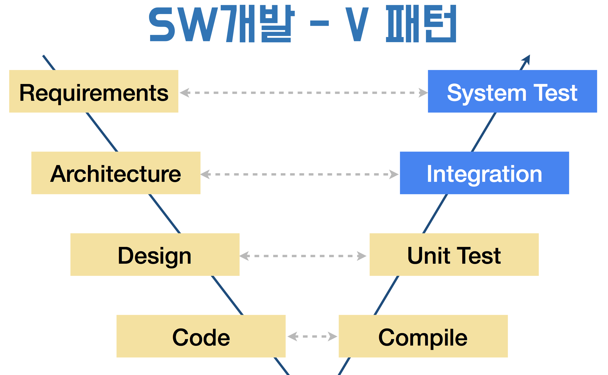

= 테스트

=== 간단한 설계 규칙

===== 테스트를 통과할 것(상)
* 테스트가 통과하는 코드를 많이 작성할 것

===== 그 다음, 의도를 드러낼 것(중)
* `Swift Style Guide를 최소한 지킬 것`

===== 중복을 제거할 것(중)
* 중복 코드를 제거하려면 코드를 단순히 줄이는 것이 아니라 의미 있는 동작으로 줄일 것
* 메서드 인터페이스가 같은게 보인다면 => 프로토콜
* 구현 내용이 같고 타입이 다르면 => 제네릭
* 상속

===== 구성 요소를 최소화할 것(하)
* 함수의 매개변수, 객체의 속성이나 메서드도 꼭 필요한 경우 추가함

=== 요구사항(Requirements)

===== 요구사항
* Requirement -> Feature -> Specification

===== 요구사항관리
* 요구사항은 통제하는 것이 아니라 지속적으로 소통하고 관리해야 하는 것
* 실제 개발 업무 시간
** Planning => 10%
** 개발 작업 시간 => 65%(협업 과정포함)
** Integration + Debug => 25%

=== 테스트

===== 테스트
* 테스트 코드를 짤 때 객체에 의존적이여서 안됨

===== SW 품질(Quality)
* 사용자는 개발자가 생각한 의도대로 사용하지 않음

===== SW공학
* Waterfall Process
* Requirements -> Specification(Design) -> Development(Implement) -> Test(Verification) -> Depolyment & Maintenance
* 단계가 줄어들 수 없음

===== SW 공학적 개발 단계
* Code Complete에서 SW 개발과정 제시함
* 현재 하나로 바라보던 공학분야에서 여러 공학분야로 나눠지고 있음
* System Test 이 후, 인수 테스트도 존재함

=== 단계별 산출물

===== 상세 설계
* UML, ERD 등 같은 설계도

===== 코딩
* 코딩 가이드
* API 설명 문서

===== 디버깅 & 단위테스팅
* 코드 정적분석 결과
* 단위 테스팅 수행 템플릿

===== 테크니컬 리뷰
* 코드 리뷰
* 코드 커버리지의 목표를 설정함
* 리팩토링

===== 성능 최적화
* 벤치마크 보고서
* 알고리즘 성능 측정 확인

=== SW개발

===== V패턴

===== 디버깅 비용
* Waterfall로 진행하게 되면 요구사항이 잘못된 것이
** 개발 단계에서 발견하면 5-10배 비용과 노력이 들어감
** 시스템 테스트 단계에서 발견하면 10배 비용과 노력이 들어감
** 실제 배포 단계에서 발견하면 10-100배 비용과 노력이 들어감

=== 언제 테스트 할 것인가?

===== 방법
* Agile, XP, Scrum

===== 애자일 방법론
* 소프트웨어 개발 방법의 하나
* 개발 대상을 다수의 작은 기능으로 나누어 하나의 기능을 하나의 반복 주기 내에 개발하는 개발 방법
* 기간은 1-4주, 한 기능을 추가 개발함
* 계획, 요구분석, 설계, 구현(코딩), 테스트 및 문서화 등 소프트웨어 프로젝트에 필요한 모든 과정이 하나의 반복 내에서 모두 실시함
* 반복이 끝날 때마다 기능이 추가된 새로운 소프트웨어(빌드)를 출시하는 것을 목표함
* 반복이 끝나면 프로젝트팀은 프로젝트의 우선순위를 재평가하여 다음 반복을 시행

=== 단위테스트

===== print, NSLog
* 일일이 프린트로 찍어보고 손으로 직접 테스트하는 것을 `Smoke Test` 라고 함
* 안 좋은 방법임

===== _단위 테스트보다 큰 목적_
* *내 코드가 잘 돌아가나 확신하는 방법*
* 요구사항을 위해 설계했던 그대로 동작하는가?
* 예외적인 상황에서도 원하는 동작 하도록?
* 내 의도를 문서화 할 때

===== 단위테스트 TIP
* 객체가 의존적이지 않도록 값을 넘겨주는 형태로 작성하는 것이 좋음
* Right-BICEP
** Right
*** 결과가 올바른가? => 요구사항은 변경함
*** 쉽게 빠르게 증명할 수 있음
*** 테스트 데이터를 활용할 수 있음
** B(= Boundary)
*** 경계값을 밝혀내는 것이 중요함
*** 엉터리 입력값
*** 잘못된 형식 데이터
*** 아예 없거나 빼먹은 값
*** 예상치를 벗어난 값
*** 중복 값이 있으면 안 되는데 중복된 값이 존재
*** 순서/정렬된 데이터에서 정렬이 맞지 않음
** I(= Inverse)
*** 루틴과 역 루틴을 작성해야 함
** C(= Cross-check)
*** 다른 수단을 이용한 교차확인
*** 해당 알고리즘과 다른 알고리즘 비교함
*** 데이터나 클래스를 분리해서 대조하는 방식도 고려해야 함
** E(= Error Condition)
*** 에러 조건 강제로 만듦
*** Mock 객체 이용
** P(= Performance)
*** 성능
*** 입력량이 많아지거나 문제가 복잡해짐
*** 빠른 회귀 테스트
*** 전문적인 도구를 이용할 수 있음
* 경계조건, CORRECT
** 경계 조건 버그 유발
** 형식일치(= Conformance) 
** 순서(= Ordering)
** 범위(= Range)
** 참조(= Reference)
** 존재성(= Existence) 
** 개체 수(= Cardinality) 
** 시간(= Time)
* A-TRIP
** 자동적(= Automatic)
*** 단위 테스트는 실행과 결과의 확인은 자동화되어야 함
** 철저함(= Through)
*** 해당 기능의 문제가 될 경우의 수를 모두 테스트함
** 반복 가능(= Repeatable)
*** 순서 상관없이 반복 실행할 수 있고 같은 결과가 나와야 함
** 독립적(= Independent)
*** 다른 테스트 / 외부 환경에 독립적 (의존성이 없어야 함)
** 전문적(= Professional) 
*** 테스트 코드도 진짜 코드
*** _**테스트 가능한 코드 작성이 좋음**_

=== 테스트를 하면서..?

===== 테스트 코드의 버그를 발견함. 어떻게 할 것인가?
* 버그를 고칠 때 테스트도 개선하거나
* 버그를 집어넣어 테스트를 검증하자
** 레거시 코드. 버그에서 발견했을 때 테스트 코드를 추가하고
** 수정하면서 필요한 테스트 코드를 추가함