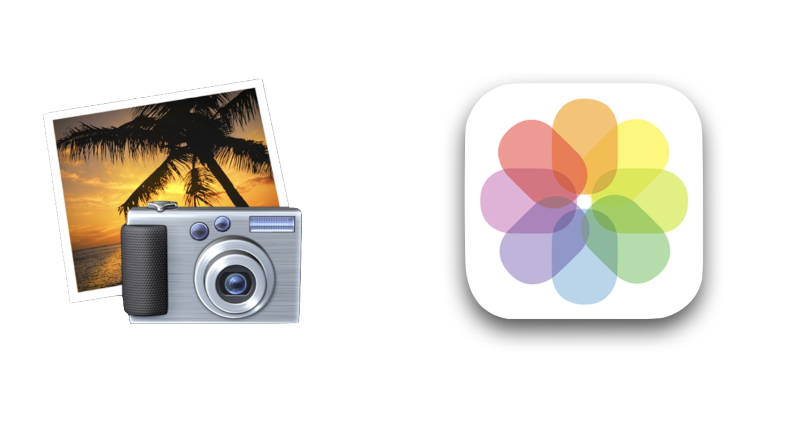

= ADS

=== 제품 정의
* 기능 목록을 모으지 말고 솔루션을 정의하라

=== 솔루션 정의하기

===== 핵심 솔루션 정의하기
* 정리하기
* 편집하기
* 공유하기

=== ADS(Application Definition Statement)
* *고객* 을 위한
* 자신만의 *차이점*
* 자신의 *솔루션* 
* 캐주얼 및 아마추어 사진가를 위한 사용하기 쉬운 사진 편집, 정리, 공유 앱

=== 실습

===== 실습 과제 => "씀"
* 고객
** 20-30대
** 글쓰기를 좋아하는 사람
** 아날로그 감성을 느끼고 싶은 사람
* 차이점(= 다른 글쓰기(일기, SNS)류의 앱과 다른 점)
** 익명성 보장
** 글을 담아간 사람의 히스토리를 보여주지 않음
** 감성을 공유함
* 솔루션
** 글감을 하루에 두 번씩 제시함
** 글 편집하고 공유하기
** 아날로그 감성의 UI
* *감수성이 풍부하고 글쓰기 좋아하는 사람들에게 익명성을 보장함. 아날로그 디자인을 통해 감수성을 자극하고, 매일 제시되는 글감으로 글을 쓰고 공유하는 앱*