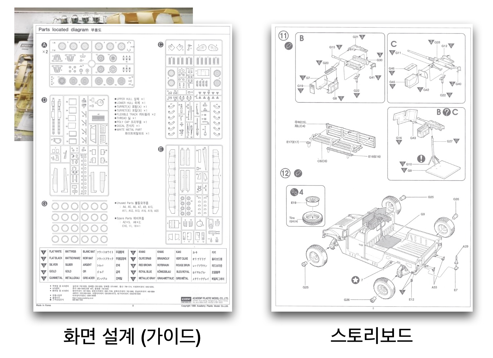

= 앱 기획과 디자인 과정

=== Concept

===== 리서치
* 사람-모바일 상호작용을 *관찰*

===== 디자인 패턴
* 다른 앱 사례를 조사함

===== Persona
* 타켓층을 정하라(= 고객을 개발하라)

===== 비전
* 어떻게 활용할 것인가?

===== 개발 기간과 예산
* 언제, 어디까지 개발할 것인가?

=== Design Workshop
* 핵심 요소를 구체화한 시나리오에 집중해서 최대한 가볍게 스케치 하기

=== 임시 Prototype 만들기

===== Wireframe
* Wireframe 도구를 활용하여 RITE(Rapid Interactive Testing and Evaluation)
* 빠르게 만들어 동작, 배치 등을 확인함

===== Wireframe에서 스토리보드
* Sketch
* Xcode Interface Builder

=== Visualization

===== 시각 디자인
* 실제 UI 요소 디자인과 애니메이션 처리

===== 앱 디자인 작업
* 아이콘, 스플래시, 레이아웃, 컴포넌트, 슬라이스 가이드

===== View 만들기 
* 좌표, 높이, 넓이, 레이아웃, 비율, 색상

=== 참고
* http://inspired-ui.com
* http://www.lovelyui.com
* http://mobile-patterns.com
* https://dribbble.com
* http://pttrns.com/