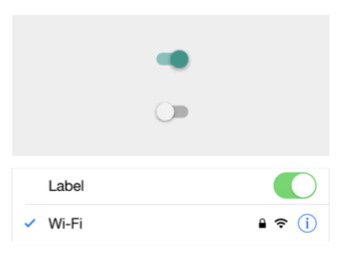

= Components

=== Components

===== 정의
* 인터페이스를 구성하는 기본 단위

=== 화면

===== Splash Screen
* 프로그램을 로드하는 동안 표시되는 이미지
* 서비스 로고, 서비스 소개 등으로 구성됨
* 로딩 중 정보 제공
* 애니메이션을 넣어 사용자가 대기하는 체감시간을 줄여주는 경우도 있음
* *사용성에 대한 제한을 받지 않음. GUI Identity를 강하게 나타날 수 있음*

===== Coach Marks
* 서비스를 처음 사용하는 사람들을 위한 도움말. 가이드 화면
* 초기 진입 n회까지 보여지도록 제공, 다시 보기 않기 버튼 제공함

===== Empty Data
* 초기 데이터가 없는 상태
* 사용자가 빈 화면을 프로그램 오류로 인식하지 않도록 도와줌

===== Walkthroughs
* 초기 세팅이 필요한 경우, 상세한 도움말을 단계별로 제공해주는 페이지 뷰
* Coach Marks 와 비슷해보이지만 차이점이 있음
* GUI Identity(=서비스)를 강하게 어필할 수 있는 페이지

===== Drawer, Slide Menu
* 평상시에는 보이지 않다가 당기거나 아이콘을 탭하면 슬라이딩 되면서 나오는 메뉴
* 주로 최상위 메뉴를 표시하거나 앱의 부가적인 기능을 모아보는데 사용함

=== Bar

===== Status Bar
* 디바이스의 현재 상태에 대한 정보를 표시하는 역할

===== App Bar, Navigation Bar, Title Bar
* Status Bar 바로 아래 위치함
* Android => App Bar
* iOS => Navigation Bar
* 사용자가 뎁스 개념을 인지할 수 있도록 도와줌

===== Tabs, Tab Bar
* Android
** Tabs 
** App Bar 바로 아래 위치함
** 같은 상위 개념의 화면을 진입하는 기능 제공

=== List

===== List View, List
* 리스트로 구성된 화면
* Line에 따라 Single Line List, Two Line List 등 이라 함
* 썸네일이 있는 경우 Thumbnail List 라고 함

===== List Index
* 같은 속성끼리 그룹핑된 리스트의 경우 그 그룹의 인덱스를 제공함
* 사용자의 인지를 도움

===== Index Scroll
* 리스트의 빠른 탐색을 도움

=== Gird

===== Grid View
* 썸네일로 구성된 화면 또는 컨텐츠의 정렬이 바둑판으로 구성된 화면

=== Dialog, Popup

===== Alert
* 경고 및 문제를 알려주는 기능
* 확인, 취소 등의 간단한 액션만 가능함

===== Toast
* 사용자가 진행한 동작에 대해 가벼운 피드백을 제공해주는 기능

===== Popup
* 사용자의 위크플로우를 결정하는 기능
* Alert, Toast를 제외한 나머지 화면 

=== Picker

===== Pickers
* 제공된 메뉴에서 사용자가 고를 수 있는 컨트롤러
* DatePicker, ColorPicker

=== Slider, Progress Bar

===== Slider 
* Slider Thumb 가 반드시 있어야 함
* Slider Thumb 를 좌우, 상하 움직여 범위 조절함
* 사용자가 컨트롤 할 수 있음

===== Progress Bar
* Slider Thumb가 없음
* 작업이 얼마나 진행되었는지 표시해주는 기능
* 사용자가 컨트롤 할 수 없음

=== ETC.

===== Drop-down List
* 디폴트 값이 항상 있어야 함

===== Radio Button
* 선택 항목들 중 1개만 선택할 수 있음

===== Check Box
* 선택 항목들 중 여러 개를 선택할 수 있는 경우 사용함

===== Toggle Button
* 활성화, 비성활를 설정할 때 사용하는 버튼

===== Switch
* On, Off를 설정할 때 쓰이는 버튼

