= Sketch 사용하기

=== 스케치 인터페이스
* Toolbar
* Canvas
* Inspector
* Layout List

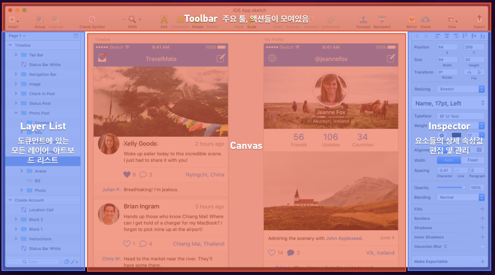

=== Insert
* 도형, 아트보드 등 삽입 관련 부분은 이 메뉴에 다 모여있음

=== 아트보드

===== 아트보드 생성하기
* 아트보드를 스케치북에 비유하면 스케치북 안에 있는 종이로 생각하면 됨
* 단축키 `A` 를 누르거나 `Insert` 메뉴로 생성할 수 있음

===== 아트보드 삭제하기
* 아트보드를 선택하고 단축키 `Shift + Delete` 를 누르거나 오른쪽 마우스를 클릭하고 `Delete` 메뉴로 삭제할 수 있음

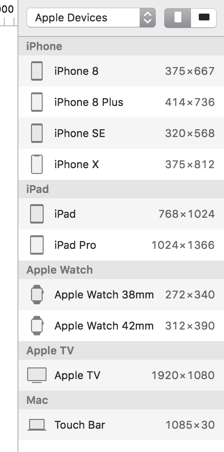

===== 아트보드 선택하기
* 아트보드 선택할 때 보여지는 선을 `포커스 라인` 이라고 함
* 아트보드가 그룹처럼 움직이지만 엄연히 그룹은 아님

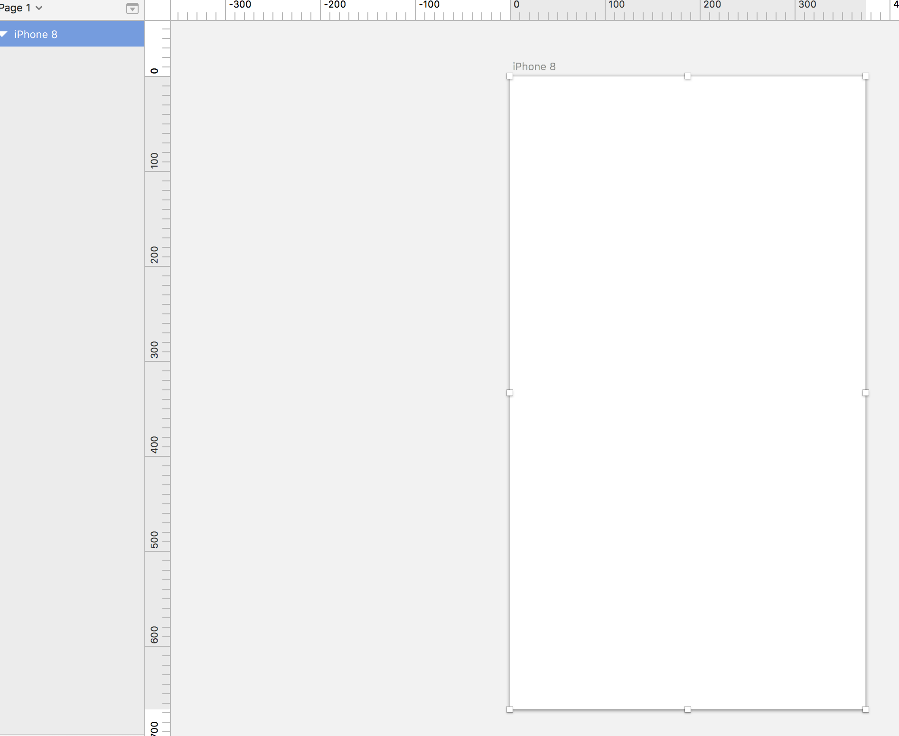

===== Tip
* 단축키 `Command + 0` 을 누르면 캔버스 영역이 100% 맞춰짐
* 단축키 `Command + 1` 을 누르면 Canvas 영역의 아트보드들이 View 영역으로 한 눈에 볼 수 있음
* 단축키 `Command + 2` 을 누르면 선택한 아트보드나 작업물 영역으로 포커스가 이동함
* 단축키 `Command + +` 을 누르면 Zoom In
* 단축키 `Command + -` 을 누르면 Zoom Out

=== 도형

===== 라인
* 단축키 `L`

===== 원
* 단축키 `O`

===== 사각형
* 단축키 `R`

===== 다각형
* 6을 설정하면 육각형, 7을 설정하면 칠각형 등 # 숫자를 입력하면 #각형이 됨

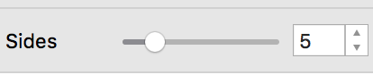

===== 별
* Radius
** 모서리 둥근 정도
* Points
** Points는 중심점부터 돌출된 부분까지 길이를 말함
** # 숫자를 입력하면 #별이 됨
** 8로 설정하였을 경우, 두 번째 이미지처럼 바뀌는 것을 확인할 수 있음

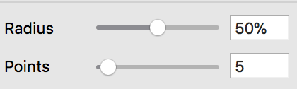

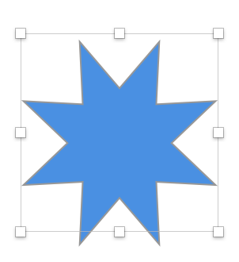

===== 도형 옵션
* 기존에 알고 있던 옵션은 정리 안함. 새롭게 알게 된 옵션만 정리함
* `Boader`
** 단축키 `B`
** Boader Position은 도형 기준
* `Boader -> 톱니바퀴` 모양을 선택하면 아래 이미지와 같은 창을 확인할 수 있음
** Ends => 변
** Joins => 모서리
** 첫 번째 Dash는 첫 번째 점선길이, 첫 번째 Gap은 첫 번째 점선과 다음 점선의 간격 길이, 두 번째 Dash는 두 번째 점선길이, 두 번째 Gap은 두 번째 점선과 다음 점선 간격 길이

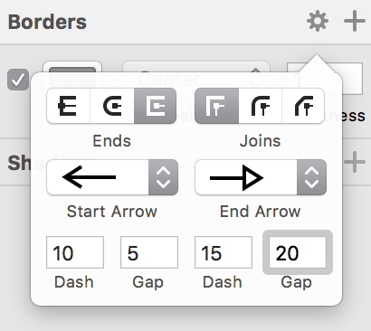

* `Fills`
** 단축키 `F`
** 옵션을 중첩시킬 수 있고 체크 해제해서 효과 적용을 뺄 수도 있음. 몇 개의 옵션도 이와 비슷함

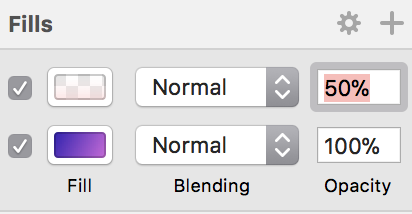

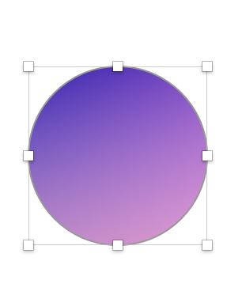

===== 도형 편집
* `Toolbar` 를 이용하거나 `도형을 선택하여 더블클릭` 하면 도형을 편집할 수 있음

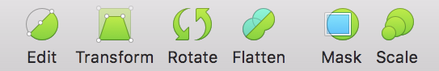

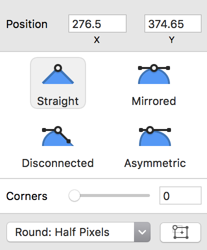

===== 레이어 복사
* `Option + 드레그`
* `Command + D`

===== 레이어 정렬 
* 레이어 정렬은 픽셀 단위
* 오브젝트를 그릴 때 벡터 기반
* 해당 질문은 정렬 옵션을 사용했을 때 픽셀 값이 변경되는데 괜찮냐고 물어보는 내용. 픽셀이 조금 맞지 않더라도 유지하는 쪽으로 선택하는 것이 좋음

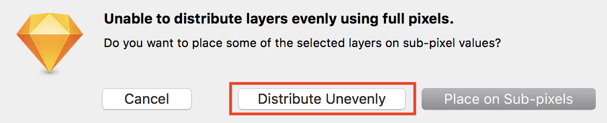

===== 배열
* 세 개 이상의 도형에서 사용할 수 있음

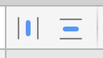

===== 도형 합치기
* 왼쪽에서부터 오른쪽 순서대로 누른 결과

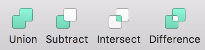

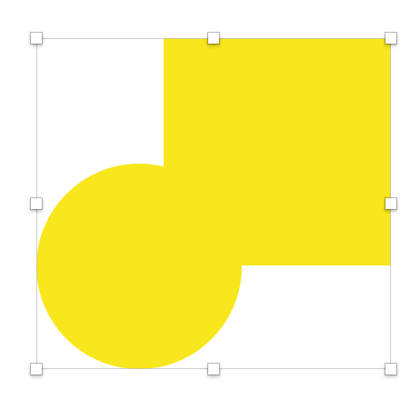

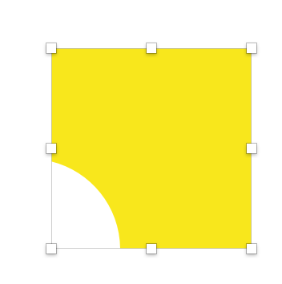

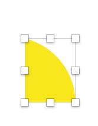

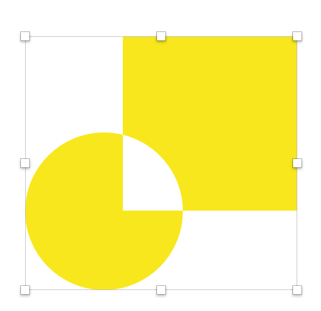

===== Tip
* `Shift` 키를 누른 채 도형을 그리면 정사각형, 정다각형 등 각 변의 길이가 같은 도형을 그릴 수 있음
* 아래 이미지에서 자물쇠가 잠금 모양이 되면 각 변의 길이가 같은 사이즈으로 도형이 커짐

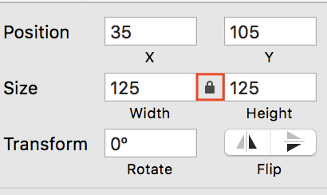

* 도형 선택 후, `Control + C` 누르면 제일 위에 있는 옵션으로 스포이트 활성화 함

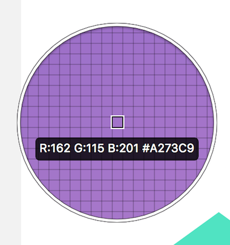

