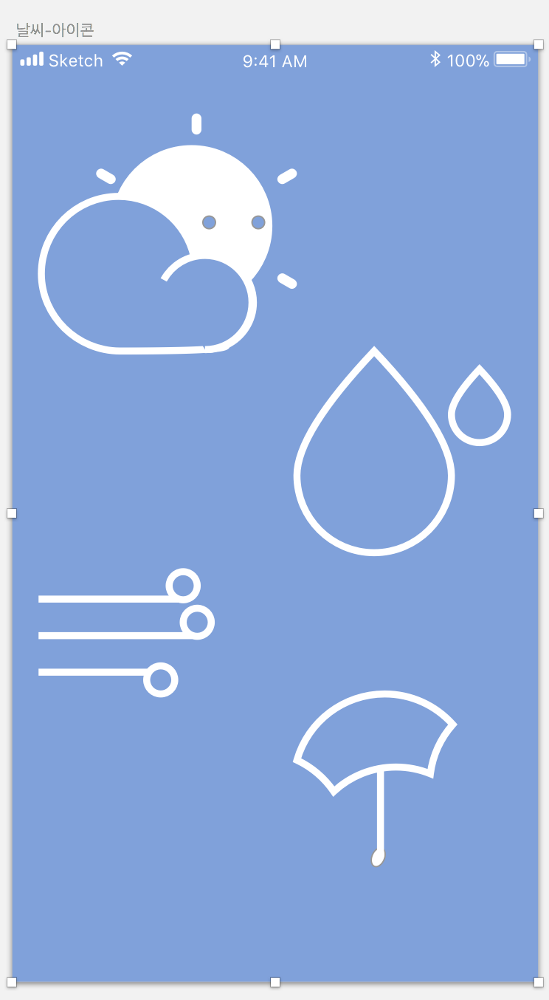

= Icon

===== 정의
* 내가 모르는 언어로 메뉴를 작성할 경우 사용하는데 어려움이 있음
** 아이콘을 사용할 경우 정보를 한눈에 파악할 수 있음

> 그림 기호의 일종이며 컴퓨터, 모바일 등 디스플레이에서 사용자의 이해를 돕기 위해 사용함. 표현하고자 하는 정보의 내용을 한눈에 파악할 수 있도록 정보의 내용을 함축하고 있는 이미지 기호

===== 용도
* 인터페이스
* 정보 시각화
* 컨텐츠
* 일러스트 그래픽

===== 아이콘 디자인 원칙
* 명확한 의미 전달
** 명확한 메타포를 선택하는 것이 중요함
* 시각적 규모, 크기의 통일성
** 실제 크기보다 시각적인 크기의 통일성이 더 중요함
* 아이콘들 간의 일관성 및 통일성
** 대표가 되는 스타일을 일관되게 적용해야 함
*** 시각적인 복잡도나 크기 일관성도 중요함
**** 예를 들어 단순함과 복잡함이 섞이는 형태보다 단순한 형태는 단순함으로 복잡한 형태는 복잡함으로
*** 선의 두께, Round 값, 색상 등 아주 디테일한 부분도 일관성 있는 것이 중요함

===== 아이콘 스타일
* 라인 스타일(= 라인 아이콘)
* 솔리드 스타일(= 솔리드 아이콘)
* 라인이냐? 면이냐? 라인, 면 둘다 사용하느냐?
* 추가적인 포인트 컬러 
* 장식적인 효과

===== 연습

