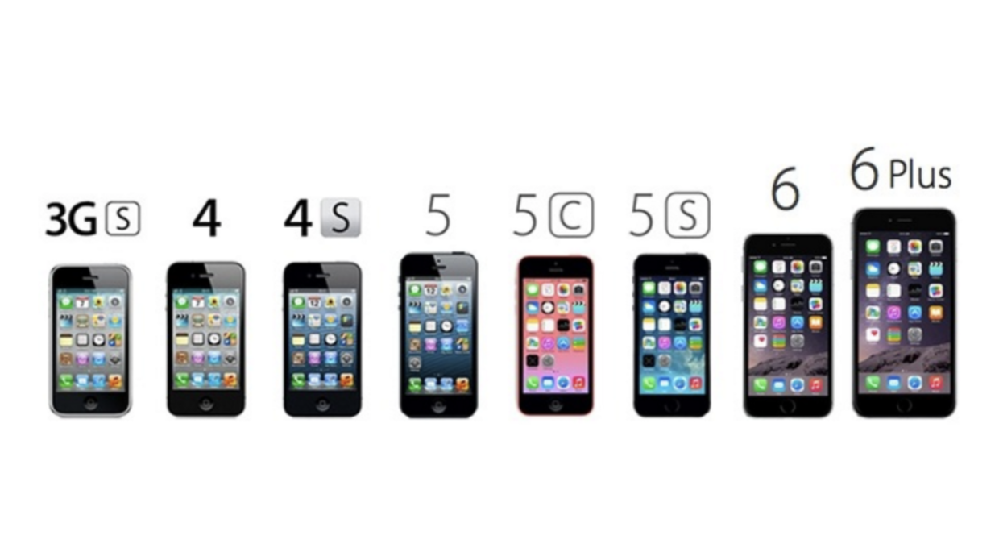
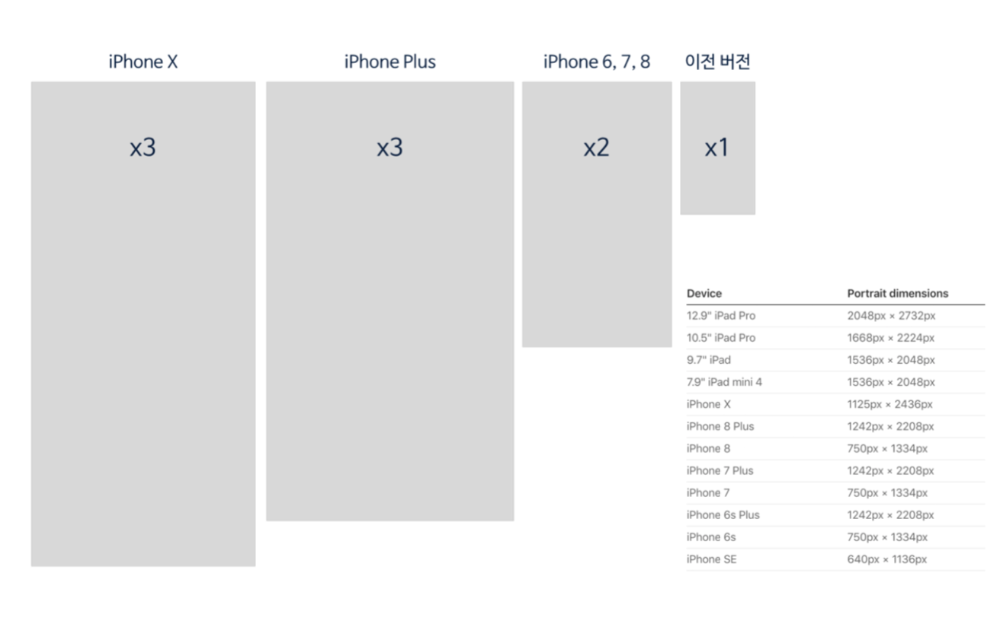

= iOS, Android Design

=== iOS

===== 기본정보
* iPhone, iPad 상에서 이루어지는 모든 소프웨어의 생태계 시스템을 이해할 수 있음

===== 디바이스 해상도
* `Adaptivity and Layout 링크 참고`

===== 해상도 기본 단위
* Pixel

===== 축적계수
* 1배수, 2배수, 3배수
* img.png, img@2x.png, img@3x.png 

===== 가변 리소스 대응 방식 차이
* 예를 들어 카드 포스트
** 콘텐츠에 따라 높이가 달라진다면 세 개의 등분으로 나눠서 개발자에게 제공함. 원하는 높이 값만큼 가운데 리소스를 늘림
** 콘텐츠에 따라 너비가 달라진다면 세 개의 등분으로 나눠서 개발자에게 제공함. 원하는 너비 값만큼 가운데 리소스를 늘림

===== 사이트, 리소스
* 사이트 => `Human Interface Guidelines 링크 참고`
* 리소스 => `Apple UI Design Resources 링크 참고`

=== Android

===== 기본정보
* 삼성, LG, HTC 등 다양한 모바일 제조사가 자사에 맞게 커스텀해서 사용하는 구글의 소프트웨어 생태계 시스템으로 이해할 수 있음

===== 디바스 해상도
* https://material.io/devices/[Device Metrics]
* dp, dpi Based(= Dots Per Inch), 1인치 안으로 들어가는 점의 개수. 점의 개수가 높아질수록 고해상도

===== 축적 게수
* 다양한 해상도를 지원하기 위해 축적 계수를 사용함
** ldpi, mdpi, hdpi .. ⇒ 저밀도, 중밀도, 고밀도..
** 밀도의 범위를 의미함
** ldpi => 1x1 inch. 120개 이하
** mdpi => 1x1 inch. 120개 초과, 160개 이하
** 1x1 inch에 들어가는 도트 개수에 따라 해상도를 나눔

===== 사이트, 리소스
* 사이트 => `Material Design 링크 참고`
* 리소스 => `Materail Design > Resources > Color / Devices / templates / ...`

===== 디자이너, 기획자, 개발자의 협의해야 할 사항
* 대응 OS
* 타켓 디바이스(대표 해상도)
** iOS => 2x 해상도
** 스케치에서 1배수 해상도를 아트보드로 생성되는 이유 => 2x 해상도로 만들었을 때 요소가 소수점이 되는 것을 막기 위한 것. 벡터 기반이기에 배수가 늘어나더라도 리소스의 깨짐현상을 최소화 할 수 있음
** Android ⇒ Xxxhdpi(mdpi x 4)
** 스케치에서 mdpi로 아트보드가 생성하는 이유 => 1px = 1dp인 계산하였을 때 mdpi로 나오기 때문에 가이드라인을 정함
** `디자인 규격 알기 링크 참고`
* 멀티 스크린 대응
** 일반적으로 타켓 디바이스 해상도 배수를 늘려서 사용

=== 참고
* https://developer.apple.com/ios/human-interface-guidelines/visual-design/adaptivity-and-layout/[Adaptivity and Layout]
* https://developer.apple.com/design/[Human Interface Guidelines]
* https://developer.apple.com/design/resources/[Apple UI Design Resources]
* https://material.io[Material Design]
* http://www.suiux.com/gui_specification/[디자인 규격 알기]