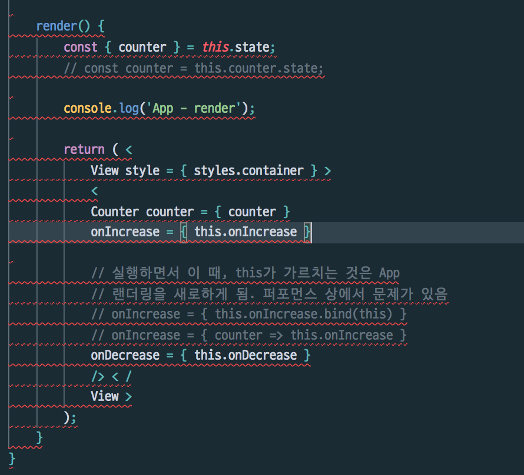

= Prettier가 작동하지 않은 이유?

===== 문제
* Prettier가 작동하지 않음

===== 해결
* 버전이 1.23.0 이후, 포맷팅 우선순위가 바뀌면서 Beautify와 충돌이 일어남
* https://github.com/prettier/prettier-vscode/issues/426[Command "Format Document" doesn't work]