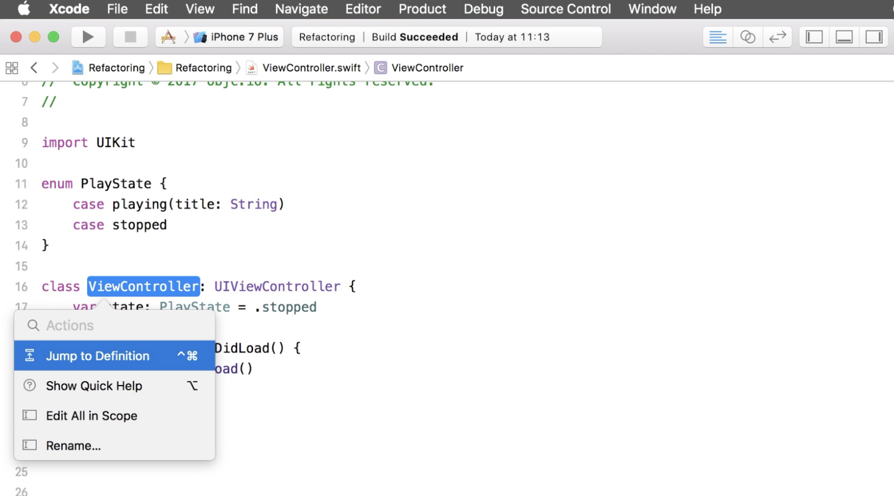
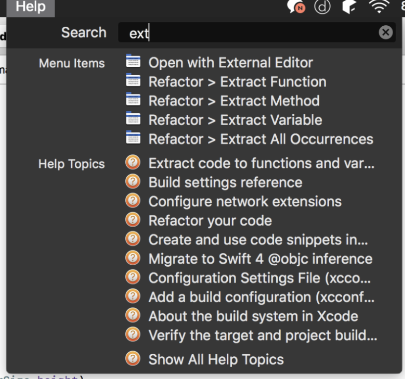
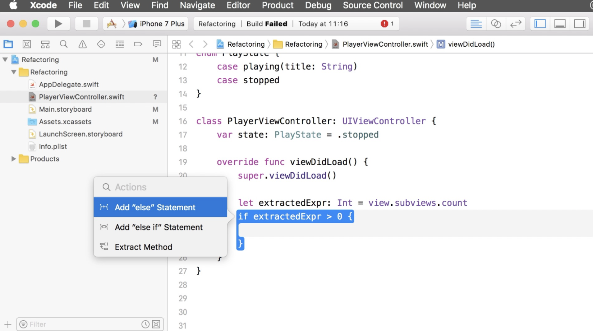
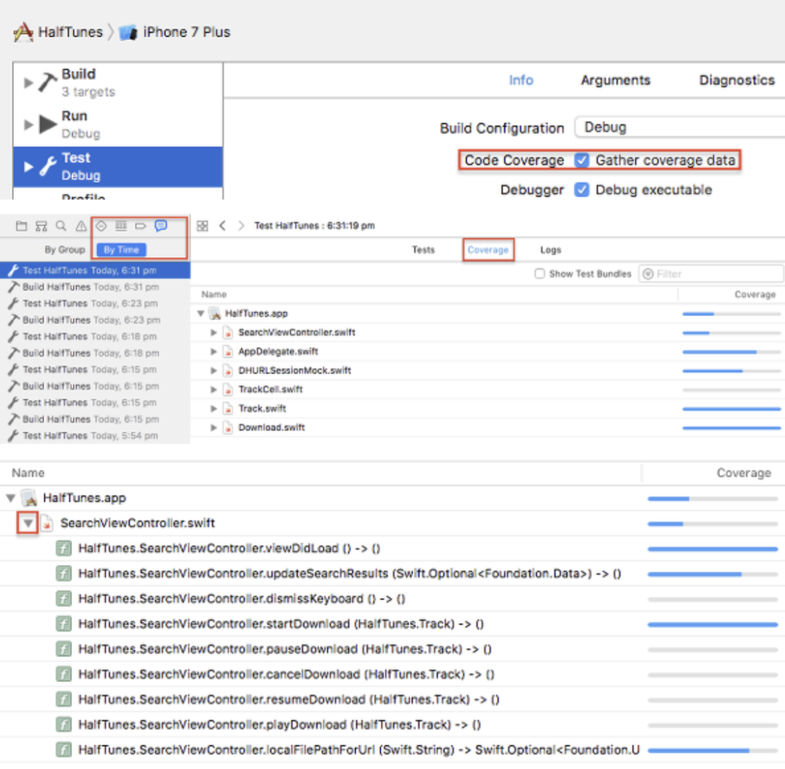

= Refactor 메뉴

===== Renaming
* _Command + Shift + A_

===== Extract..
* _Editor > Refactor > .._
* _Command + Shift + ? > Extract_

===== Userful Actions
* _Command + Shift + A_
* if-else, switch-case, enum에서도 사용가능함

===== Test Coverage 설정

